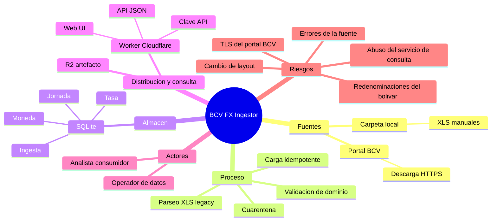

# Project Charter — BCV FX Ingestor

* **Estado:** approved
* **Fecha:** 2026-07-14
* **Decisores:** Jeremi Alcalá (owner)
* **Fase AI-DLC:** 00-project
* **Versión:** 0.3.0
* **Sponsor:** Jeremi Alcalá
* **Owner del proyecto:** Jeremi Alcalá

## Visión

Construir un proceso confiable e idempotente que ingiera los archivos históricos de tipos de cambio de referencia del BCV (`2_1_2*_smc.xls`) y los cargue en una base SQLite consultable, preservando la integridad de la serie histórica.

## Alcance

* Incluye:
  * Descarga de archivos históricos desde el portal del BCV (bcv.org.ve).
  * Ingesta de archivos `.xls` colocados manualmente en una carpeta local de entrada.
  * Parseo del layout oficial (una hoja por fecha de operación, ~23 monedas, BID/ASK en M.E./US$ y Bs./M.E.).
  * Validación de dominio (rangos, BID≤ASK, monedas conocidas) y cuarentena de datos anómalos.
  * Carga idempotente a SQLite con trazabilidad archivo → jornada → tasa.
  * CLI en Python para operar el proceso.
  * API JSON de consulta y Web UI mínima de consulta/descarga sobre el artefacto publicado, servidas por el Worker de Cloudflare y protegidas por clave API. *(Incorporado 2026-07-14, feature FX-ING-002.)*
* **No incluye (no-scope):**
  * API GraphQL y consultas de escritura/corrección sobre los datos. *(El no-scope original «API de consulta (REST/GraphQL)» fue levantado parcialmente el 2026-07-14: la consulta REST/JSON pasa al alcance vía FX-ING-002.)*
  * Dashboards analíticos o de visualización. *(La «interfaz gráfica» simple de consulta/descarga pasó al alcance el 2026-07-14, FX-ING-002.)*
  * Tasas de otras fuentes (paralelo, plataformas privadas) o cálculo de tasas derivadas.
  * Corrección automática de errores de la fuente (solo detección y cuarentena).
  * Scheduling gestionado (queda en manos del operador vía cron).

## Mapa mental del alcance

## Stakeholders

| Rol | Nombre | Responsabilidad |
| --- | --- | --- |
| Sponsor / Owner | Jeremi Alcalá | Decisiones de alcance, aprobación de gates |
| Operador de datos | <TODO: confirmar> | Ejecuta ingestas, resuelve cuarentenas |
| Analista consumidor | <TODO: confirmar> | Consume la serie histórica desde SQLite |

## Restricciones y supuestos

* Stack fijado: Python 3.11+ y SQLite (decisión del sponsor; ver ADR-0001).
* Los archivos fuente son `.xls` (BIFF, Excel 97-2003), no `.xlsx`.
* El layout observado en el modelo `2_1_2a20_smc.xls` se asume representativo; variaciones históricas se tratan como riesgo R1.
* El portal del BCV ha presentado históricamente certificados TLS inválidos; la política de verificación es una decisión de seguridad explícita (ver threat model T2).
* Datos 100% públicos: sin PII ni secretos en el dominio. *(Precisión 2026-07-14: la clave API del servicio de consulta —FX-ING-002— es un secreto operativo, no un dato del dominio; ver `data-classification.md`.)*

## Métricas de éxito del proyecto

* 100% de los archivos del modelo de referencia cargados sin pérdida de filas válidas.
* 0 duplicados en la serie (idempotencia verificable re-ejecutando la ingesta).
* Toda fila anómala termina en cuarentena con motivo trazable, nunca cargada silenciosamente.
* Una jornada consultable por `fecha_operacion` + `moneda` en <10 ms local.

## Riesgos de alto nivel

* R1: El layout del XLS cambia entre años/trimestres y el parser carga datos corridos.
* R2: Errores en la fuente oficial (evidencia real: CHF 31/03/2020 con ASK 9.96296 vs BID 0.96273).
* R3: Redenominaciones del bolívar (2018: ÷100.000; 2021: ÷1.000.000) mezclan escalas en la serie histórica.
* R4: Descarga desde el portal BCV con TLS inválido expone a suplantación de la fuente.
* R5: Abuso del servicio de consulta (claves filtradas, scraping masivo) genera costos y degradación en el edge. *(Añadido 2026-07-14, FX-ING-002.)*
