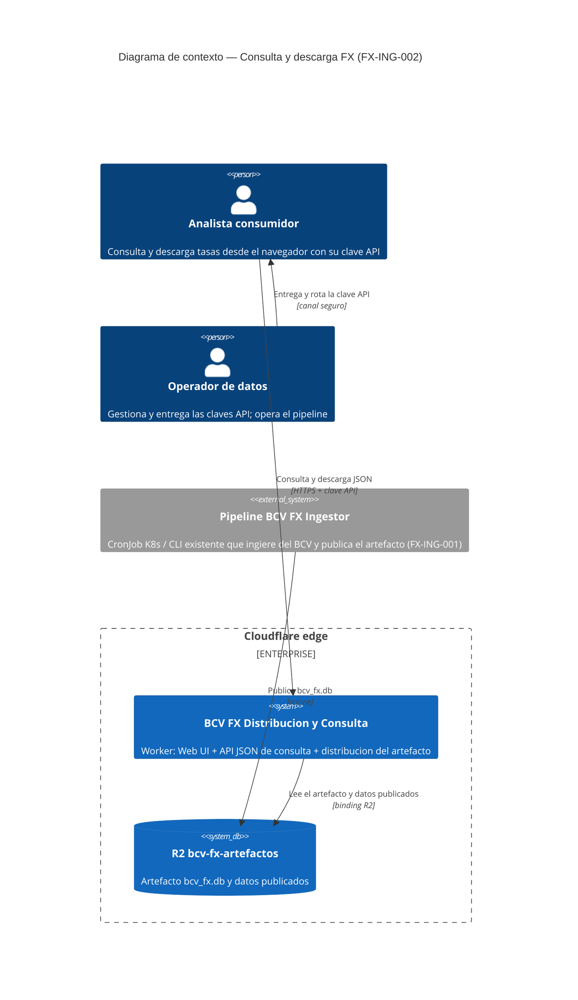
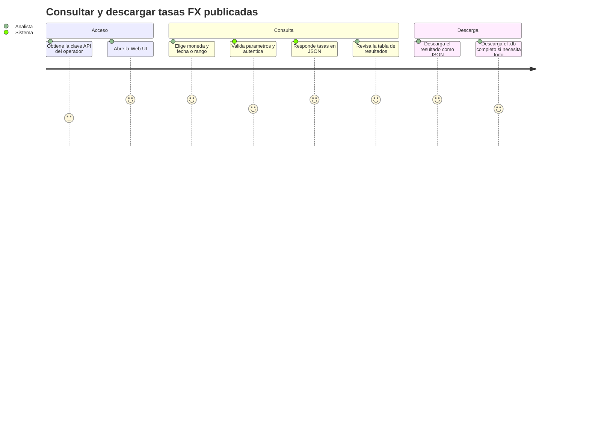
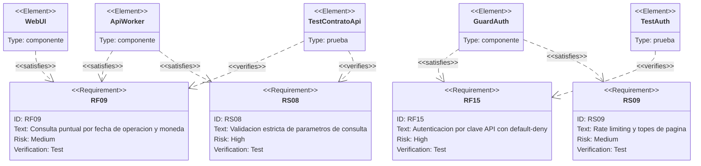
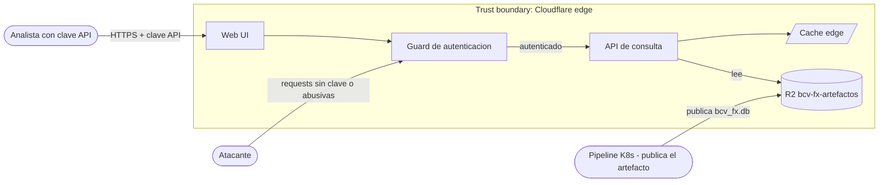
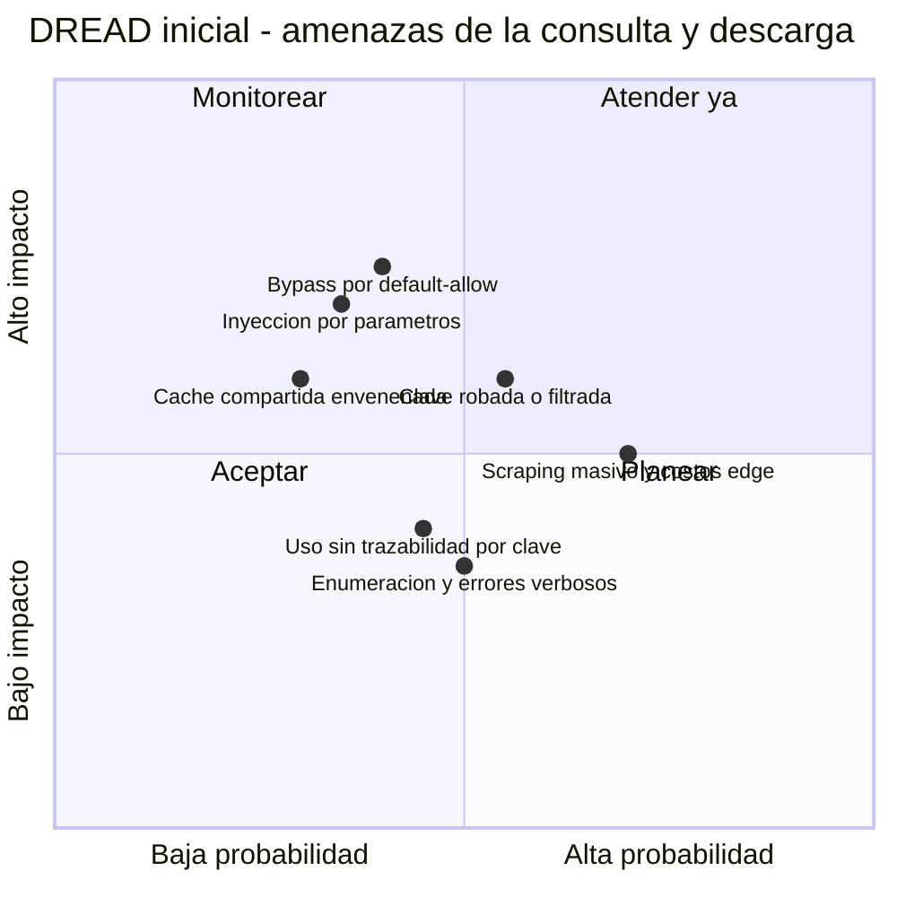

# PRD — Consulta y descarga de tasas FX vía Web UI y API (edge)

* **Estado:** approved
* **Fecha:** 2026-07-14
* **Decisores:** Jeremi Alcalá
* **Fase AI-DLC:** 01-requirements
* **Versión:** 0.2.0
* **Gate:** 0
* **Feature/Épica ID:** FX-ING-002
* **Nivel ASVS objetivo:** L1

## Problema y contexto

Hoy el único consumo remoto de la serie histórica es descargar el artefacto completo (`/bcv_fx.db`, ~2 MB) y consultarlo con SQL local. Para preguntas puntuales — la tasa de una moneda en una fecha, la serie de un rango, la última jornada publicada — eso impone fricción: herramienta SQLite, conocimiento del esquema y una descarga completa por consulta.

Este feature extiende el Worker de Cloudflare existente (hoy solo distribución: `/bcv_fx.db`, `/estado` — ADR-0006) con una API JSON de consulta de solo lectura y una Web UI mínima que la consume. La data es Pública (`data-classification.md`); el activo a proteger es la **integridad de las respuestas y el control de acceso al servicio** (abuso, costos edge, disponibilidad), no la confidencialidad — de ahí la protección por clave API. El volumen es acotado: ~1.400 jornadas, ~31.000 tasas, 23 monedas, ~6.000 filas/año.

Este PRD levanta parcialmente el no-scope original de FX-ING-001 ("exponer API de consulta", "UI"); la decisión queda anotada en `ingesta-historicos-fx.md` §Objetivos y en el charter §Alcance.

## Objetivos / No-objetivos

Objetivos: exponer consultas de solo lectura (tasa por fecha y moneda, serie por rango, última jornada, catálogo de monedas) como API JSON en el Worker; Web UI mínima (formulario → tabla → descarga) servida por el mismo Worker y que consume exclusivamente esa API; descarga del resultado filtrado como archivo JSON; acceso autenticado por clave API; frescura coherente con el artefacto publicado. No-objetivos: escritura o corrección de datos; tasas derivadas o cálculos (promedios, cruces, conversiones); GraphQL; dashboards analíticos o gráficas; otros formatos de descarga (CSV/XLSX — el bulk ya lo cubre `/bcv_fx.db`); gestión self-service de claves (alta/rotación manual por el owner); usuarios con roles.

## Contexto del sistema (C4 Context)

Nota: la forma concreta del almacén consultable en el edge (SQLite WASM sobre R2, réplica D1 o JSON precalculado) se deja deliberadamente abstracta — decisión diferida a Gate 1 (ADR-0007 pendiente; ver §Dependencias y riesgos).

## Usuarios y escenarios

### Journey del usuario

### Escenarios positivos

- E1: Con clave válida, una consulta puntual (p. ej. `GET /api/tasas?fecha=2024-05-15&moneda=EUR`) devuelve BID/ASK en ambas bases (M.E./US$ y Bs./M.E.), `cotizacion_invertida`, la escala monetaria y las fechas de la jornada.
- E2: Una serie por rango (p. ej. `desde=2024-01-01&hasta=2024-03-31&moneda=EUR`) devuelve el resultado paginado en orden cronológico; desde la UI el analista descarga exactamente ese resultado como archivo `.json`.
- E3: La consulta de la última jornada disponible devuelve fecha de operación, fecha valor, escala y sus ~23 tasas — el caso "¿cuál es la tasa de hoy?".
- E4: El catálogo de monedas alimenta el selector de la UI (23 monedas, con marca de cotización invertida).
- E5: Consultar una fecha sin jornada (fin de semana, feriado) produce un 404 controlado con mensaje claro, nunca un 500; la UI lo muestra de forma legible.

### Escenarios negativos / abuso (requerido por Gate 0)

- A1 — Clave filtrada o robada: una clave compartida en un repo, script o log es usada por un tercero; sin rotación/revocación y sin registro de uso por clave, el abuso es invisible.
- A2 — Scraping masivo / DoS: un cliente automatizado (con o sin clave) lanza miles de requests por minuto; sin rate limiting ni topes de página, degrada el servicio y dispara los costos del edge.
- A3 — Bypass de autenticación: requests sin clave o con clave inválida alcanzan rutas `/api/*` — o rutas nuevas agregadas después — por un guard con default-allow accidental.
- A4 — Manipulación de parámetros / inyección: fechas malformadas, códigos de moneda con payloads (inyección SQL si hay SQL en el edge, path traversal hacia claves de objetos R2), rangos gigantes o paginación negativa.
- A5 — Enumeración de rutas y fugas por errores: fuzzing de endpoints buscando superficies sin proteger; errores verbosos que revelan estructura interna, rutas o versiones.
- A6 — Integridad de respuesta / caché envenenada: una respuesta autenticada cacheada en caché compartida se sirve a otros clientes, o se sirve data obsoleta como vigente, incoherente con el `sha256`/`etag` que ya expone `/estado`.

## Requisitos funcionales

- RF09: Consultar tasas por `fecha_operacion` exacta, para una moneda o todas, devolviendo BID/ASK en ambas bases, `cotizacion_invertida` y la escala monetaria de la jornada.
- RF10: Consultar la serie de una moneda por rango de fechas, en orden cronológico, con paginación y tope máximo de filas por respuesta.
- RF11: Consultar la última jornada disponible con sus tasas.
- RF12: Exponer el catálogo de monedas disponibles.
- RF13: Descargar el resultado de cualquier consulta como archivo JSON (`content-disposition: attachment`), con el mismo shape que la respuesta de la API.
- RF14: La Web UI se sirve desde el mismo Worker y consume exclusivamente los endpoints públicos de la API (sin canal privilegiado ni consultas directas al almacén).
- RF15: Autenticación por clave API enviada en header (nunca en la URL) para toda la superficie de consulta, con default-deny; la UI solicita la clave al usuario — jamás la incrusta en su código.
- RF16: `/estado` y `/bcv_fx.db` permanecen públicos y sin cambio de contrato (compatibilidad: `health.yml` y los consumidores actuales dependen de `/estado`).
- RF17: Toda respuesta de consulta incluye metadatos de procedencia y frescura del artefacto publicado (fecha de publicación y `sha256`/`etag`, coherentes con `/estado`).

## Requisitos no funcionales

- RNF04: Latencia p95 < 500 ms en el edge para consultas puntuales (fecha + moneda); < 2 s para un rango anual paginado.
- RNF05: El servicio de consulta no degrada la distribución existente: `/bcv_fx.db` y `/estado` mantienen su comportamiento y caché actuales.
- RNF06: Frescura coherente con el SLO existente del artefacto (`observability.md`: edad de `subido` ≤ 4 días naturales, medida vía `/estado`): la API sirve el mismo artefacto que `/bcv_fx.db`, sin fuente de verdad paralela que pueda desincronizarse.
- RNF07: Respuestas acotadas: página máxima configurable (propuesta: 1.000 filas / ~1 MB); una serie anual (~250 jornadas) cabe en una página; el rango completo de una moneda (~1.400 filas) en dos.

## Trazabilidad de requisitos

## Requisitos de seguridad (mapeados a OWASP ASVS)

| Req | Descripción | ASVS | Nivel | OWASP Top 10 |
|---|---|---|---|---|
| RS06 | Autenticación por clave API en toda ruta de consulta con default-deny (toda ruta nueva nace protegida salvo decisión explícita); comparación de la clave en tiempo constante | V4.1 (control de acceso, deniega por defecto) | L1 | A01 control de acceso roto |
| RS07 | Gestión del secreto: la clave vive como secret de Wrangler (nunca en repo, código de la UI ni logs); procedimiento documentado de rotación y revocación; la clave viaja en header, jamás en query string | V2.10 (secretos de servicio), V8.3 (datos sensibles fuera de la URL) | L1 | A02 / A05 |
| RS08 | Validación estricta de entrada: fecha ISO-8601, moneda contra allowlist (catálogo), rango acotado, paginación numérica con topes; si hay SQL en el edge, exclusivamente parametrizado | V5.1 (validación de entrada), V5.3 (queries parametrizadas) | L1 | A03 inyección |
| RS09 | Anti-automatización: rate limiting por clave e IP, límites de tamaño de página y de respuesta | V11.1 (lógica de negocio, anti-automatización) | L1 | A04 diseño inseguro |
| RS10 | Caché y headers: respuestas autenticadas nunca en caché compartida (o cache key sin credenciales); `cache-control` explícito por endpoint; headers de seguridad en la UI (CSP, `X-Content-Type-Options`) | V8.2 (control de caché), V14.4 (headers de seguridad) | L1 | A05 misconfiguración |
| RS11 | Auditoría de uso: log de accesos por clave (identificador de la clave, nunca la clave completa) y de todo rechazo de autenticación | V7.1/V7.2 (logging de seguridad) | L1 | A09 logging |

## Threat assessment inicial

Amenazas (STRIDE-lite): T1 — Spoofing: uso de clave robada/filtrada (A1). T2 — Tampering: inyección/manipulación de parámetros (A4). T3 — Denial of Service: scraping masivo y costos edge (A2). T4 — Elevation of Privilege: ruta sin guard por default-allow (A3). T5 — Information Disclosure: enumeración y errores verbosos (A5). T6 — Tampering: caché compartida sirviendo respuestas autenticadas u obsoletas (A6). T7 — Repudiation: uso sin trazabilidad por clave (A1).

## Métricas de éxito

- Toda consulta puntual devuelve exactamente lo que devuelve SQL directo sobre el `.db` publicado (casos dorados; incluye que las filas en cuarentena — p. ej. CHF 31/03/2020 — NO aparecen).
- 100% de los requests sin clave válida rechazados (401/403) en los tests de contrato; 0 rutas de consulta accesibles sin autenticación.
- p95 de consulta puntual < 500 ms (RNF04), medido desde un cliente externo.
- El analista obtiene y descarga la serie anual de una moneda desde la UI sin herramientas locales (0 pasos SQL).

## Dependencias y riesgos

- **Decisión técnica diferida a Gate 1 → ADR-0007 (pendiente):** mecanismo de consulta en el edge — (a) SQLite WASM leyendo el objeto R2, (b) réplica en Cloudflare D1, (c) JSON precalculado por jornada/moneda publicado por el CronJob junto al `.db`. Supersede parcialmente ADR-0006 ("solo distribución"). Riesgos por opción: (a) tamaño del bundle WASM y cold start; (b) doble fuente de verdad y migración; (c) explosión de objetos y consistencia con el `.db`.
- Mecanismo de rate limiting (WAF de Cloudflare vs. lógica en el Worker) según el plan contratado — decisión de Gate 1.
- Ciclo de vida de la clave API manual (alta/rotación por el owner): riesgo operativo aceptado en esta fase; el procedimiento se documenta con RS07.
- Compatibilidad estricta con `/estado` (lo vigila `health.yml`) y `/bcv_fx.db` (RF16, RNF05).
- El Worker no tiene hoy `package.json` ni tests JS: la fase de testing de este feature requerirá un harness (p. ej. vitest + miniflare) — dependencia de gates posteriores.
