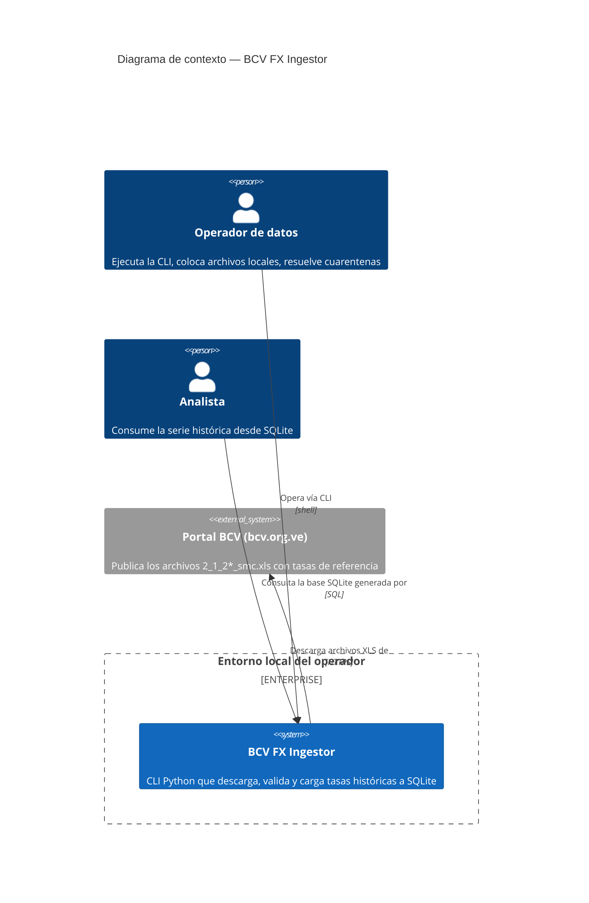
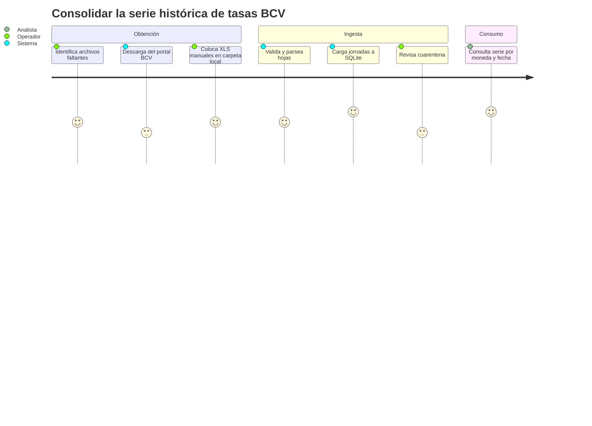
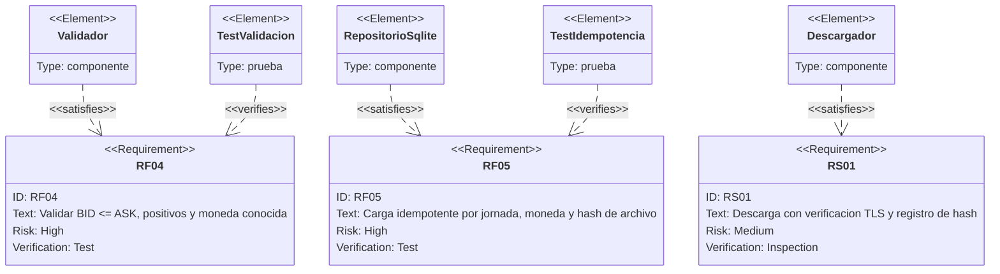
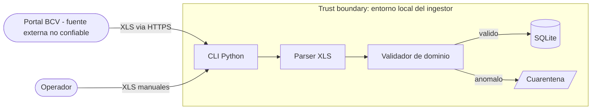
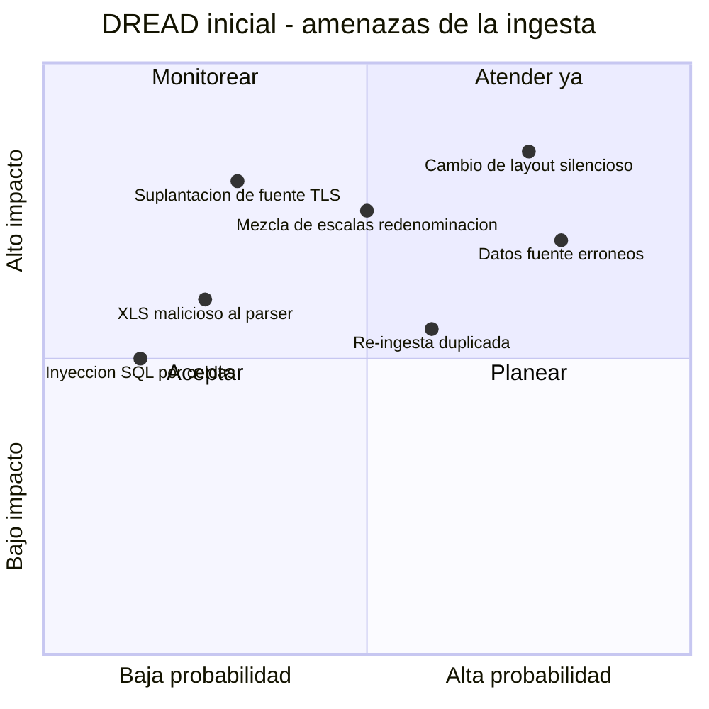

# PRD — Ingesta de tipos de cambio históricos del BCV

* **Estado:** approved
* **Fecha:** 2026-07-14
* **Decisores:** Jeremi Alcalá
* **Fase AI-DLC:** 01-requirements
* **Versión:** 0.4.0
* **Gate:** 0
* **Feature/Épica ID:** FX-ING-001
* **Nivel ASVS objetivo:** L1

## Problema y contexto

El BCV publica los tipos de cambio de referencia en archivos `.xls` legacy (`2_1_2*_smc.xls`), con una hoja por fecha de operación. Analizar la serie histórica exige consolidar decenas de archivos y cientos de hojas en un formato consultable. Hoy ese trabajo es manual, propenso a errores y no reproducible. Se necesita un proceso que descargue/reciba esos archivos, los valide y los cargue en SQLite de forma idempotente y auditable.

El modelo de referencia (`2_1_2a20_smc.xls`) confirma el layout: hojas `DDMMYYYY`, cabecera con momento de publicación, fecha de operación y fecha valor, tabla de ~23 monedas con BID/ASK en dos bases (M.E./US$ y Bs./M.E.), y notas legales. También confirma que la fuente contiene errores reales (CHF 31/03/2020: BID 0.96273, ASK 9.96296).

## Objetivos / No-objetivos

Objetivos: consolidar la serie histórica en SQLite; garantizar idempotencia; detectar y aislar anomalías de la fuente; trazar cada tasa hasta su archivo de origen. No-objetivos: exponer API de consulta; corregir datos de la fuente; tasas no oficiales; UI. *(Actualización 2026-07-14: los no-objetivos «exponer API de consulta» y «UI» se levantan y pasan al alcance del feature FX-ING-002 — `consulta-descarga-fx.md`; siguen fuera del alcance de este feature FX-ING-001. «Corregir datos de la fuente» y «tasas no oficiales» permanecen como no-objetivos del proyecto.)*

## Contexto del sistema (C4 Context)

## Usuarios y escenarios

### Journey del usuario

### Escenarios positivos

- E1: El operador ejecuta `bcv-ingest descargar --desde 2020-01 --hasta 2020-12`; el sistema descarga los archivos del período, los carga y reporta jornadas nuevas/duplicadas/en cuarentena.
- E2: El operador coloca `2_1_2a20_smc.xls` en la carpeta de entrada y ejecuta `bcv-ingest cargar entrada/`; las 3 jornadas del archivo quedan en SQLite con trazabilidad al archivo y su hash.
- E3: Re-ejecutar E2 no crea duplicados; el sistema reporta "ya ingerido" por hash y por clave de jornada.

### Escenarios negativos / abuso (requerido por Gate 0)

- A1 — Archivo malformado o malicioso: un `.xls` corrupto, con layout inesperado o construido para explotar el parser (bomba de celdas, BIFF inválido) no debe ejecutar código ni cargar datos parciales; la ingesta termina en cuarentena con motivo.
- A2 — Suplantación de la fuente: un atacante en la red (o un DNS envenenado) sirve un XLS adulterado en lugar del BCV. Sin verificación TLS estricta y registro de hash, la serie se corrompe silenciosamente.
- A3 — Datos fuente inconsistentes: la fuente publica valores erróneos (caso real CHF 31/03/2020, ASK ≈ 10× BID). Cargarlos sin validación contamina cualquier análisis derivado.
- A4 — Re-ingesta manipulada: alguien reemplaza un archivo local ya ingerido por una versión alterada con el mismo nombre; el sistema debe detectar el cambio de hash y no sobreescribir silenciosamente.
- A5 — Inyección vía contenido de celdas: cadenas en celdas (nombres de país, notas) usadas para inyección SQL al construir queries.
- A6 — Mezcla de escalas: cargar jornadas pre y post redenominación sin marcar la escala produce series numéricamente absurdas sin que nadie lo note.

## Requisitos funcionales

- RF01: Descargar archivos SMC históricos del portal BCV por rango de fechas, sin re-descargar los ya ingeridos.
- RF02: Ingerir archivos `.xls` desde una carpeta local de entrada.
- RF03: Parsear cada hoja `DDMMYYYY`: fecha operación, fecha valor, momento de publicación y, por moneda, BID/ASK en M.E./US$ y Bs./M.E.
- RF04: Validar reglas de dominio: BID ≤ ASK, valores > 0, código de moneda conocido, fechas coherentes (valor ≥ operación) y coherencia del spread BID/ASK entre las dos bases de cotización. *(Refinamiento 2026-07-12, verificado contra el archivo real: el caso CHF 31/03/2020 cumple BID≤ASK numéricamente — 0.96273 ≤ 9.96296 —; lo que delata el error es que el spread en M.E./US$ (~935%) es incoherente con el de Bs./M.E. (~0,25%) de la misma fila. Calibración contra el corpus completo 2020–2026: la coherencia se mide como divergencia multiplicativa entre spreads con umbral 1.25 — los spreads legítimos anchos y estables de monedas en banda (ANG ~5,3% desde 2023, BOB ~5,6% en 2024-2025) divergen a lo sumo 1.06 y no deben ir a cuarentena; el error real más pequeño observado diverge 10.32.)*
- RF05: Cargar a SQLite de forma idempotente (UNIQUE por jornada+moneda; hash SHA-256 por archivo).
- RF06: Enviar a cuarentena archivos/filas inválidos con motivo trazable, sin abortar el lote completo.
- RF07: Registrar la escala monetaria vigente de cada jornada (redenominaciones 2018 y 2021).
- RF08: Reportar resultado de cada ejecución: cargadas, duplicadas, en cuarentena.

## Requisitos no funcionales

- RNF01: Procesar un archivo trimestral (~65 hojas) en < 30 s en hardware de escritorio.
- RNF02: Sin dependencias de servicios externos salvo el portal BCV en modo descarga.
- RNF03: Logs estructurados suficientes para auditar qué archivo produjo cada tasa.

## Trazabilidad de requisitos

## Requisitos de seguridad (mapeados a OWASP ASVS)

| Req | Descripción | ASVS | Nivel | OWASP Top 10 |
|---|---|---|---|---|
| RS01 | Descarga solo por HTTPS con verificación estricta de certificado y fallo cerrado: ante certificado inválido el proceso falla, sin mecanismo de excepción (ADR-0004); hash SHA-256 registrado por archivo | V9.1 (comunicaciones) | L1 | A02 fallas criptográficas |
| RS02 | Tratar todo XLS como entrada no confiable: parser sin ejecución de macros/fórmulas, límites de tamaño y filas | V5.1 (validación de entrada) | L1 | A03 inyección / A08 integridad |
| RS03 | Queries SQL exclusivamente parametrizadas | V5.3 | L1 | A03 inyección |
| RS04 | Integridad y auditoría: hash SHA-256 por archivo, trazabilidad archivo→jornada→tasa, log de cada decisión de cuarentena | V7 (logging), V8 (protección de datos) | L1 | A08 integridad / A09 logging |
| RS05 | Idempotencia forzada por constraints en BD, no solo por lógica de aplicación | V5.4 | L1 | A08 integridad |

## Threat assessment inicial

## Métricas de éxito

- 100% de hojas del modelo de referencia cargadas o en cuarentena con motivo (0 pérdidas silenciosas).
- Re-ingesta del corpus completo produce 0 filas nuevas.
- La anomalía CHF 31/03/2020 es detectada automáticamente por RF04.

## Dependencias y riesgos

- Disponibilidad y estabilidad del portal BCV (formato de URLs y de archivos). Patrón confirmado (2026-07-11): `https://www.bcv.org.ve/sites/default/files/EstadisticasGeneral/2_1_2{t}{AA}_smc.xls`, donde `{t}` es la letra del trimestre (`a`=I, `b`=II, `c`=III, `d`=IV) y `{AA}` el año en dos dígitos. Histórico publicado desde 2020-TI (`a20`) hasta el trimestre en curso; períodos anteriores a 2020 e inexistentes responden HTTP 404 (señal limpia para el descargador).
- Librería de parseo de `.xls` legacy (xlrd) sin mantenimiento activo — ver ADR-0003.
- Política TLS frente al certificado del portal BCV — decidida (2026-07-11): verificación estricta con fallo cerrado, sin excepciones; ante certificado inválido el respaldo operativo es el modo local (ADR-0004, ADR-0002).
