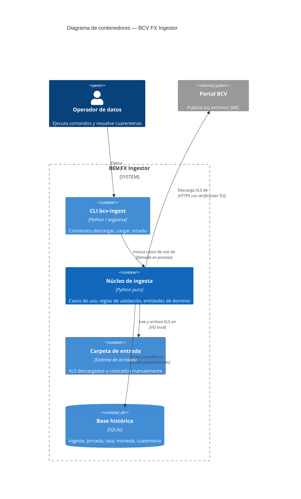
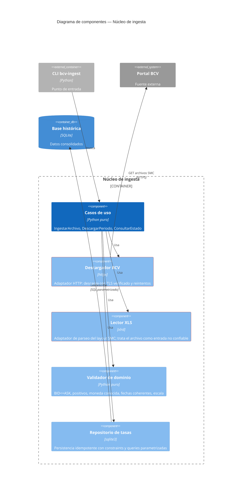
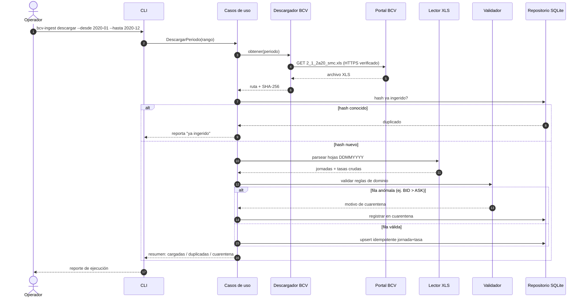
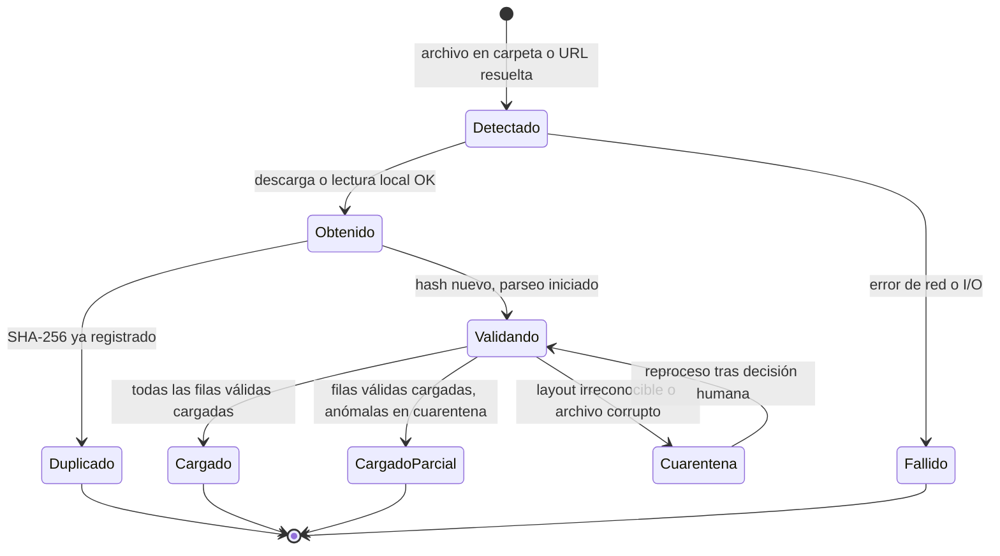
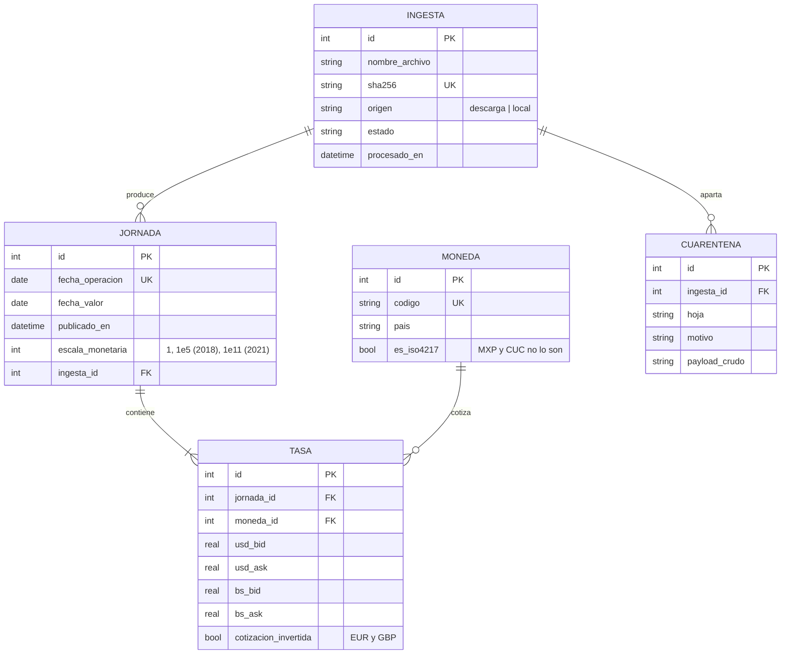
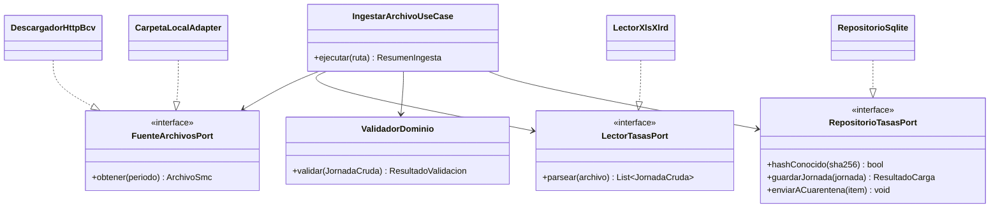
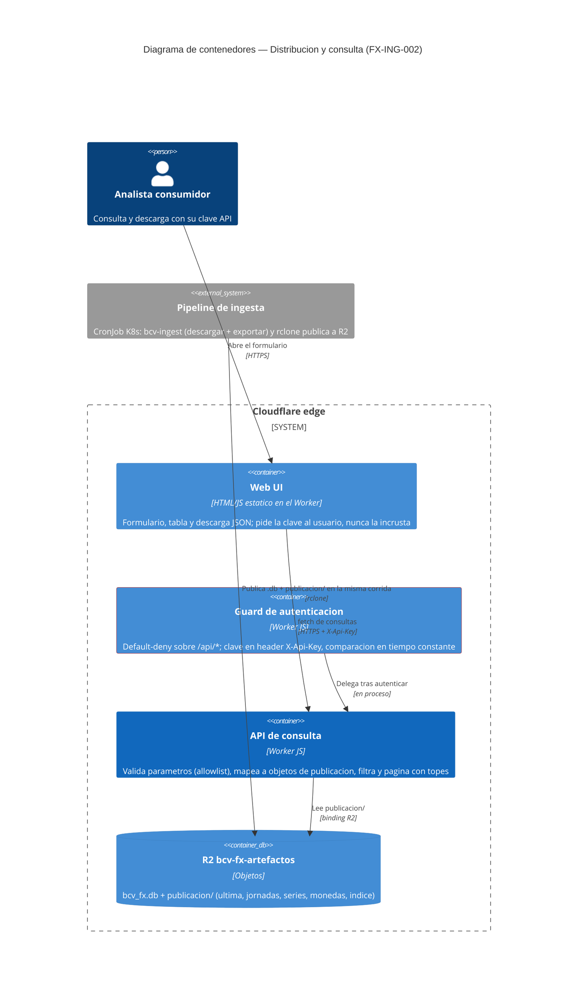
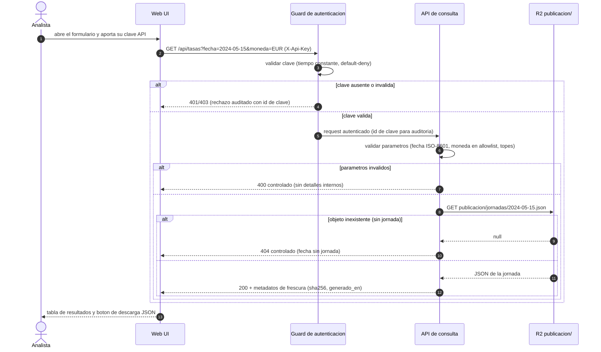

# Diseño del Sistema — BCV FX Ingestor

* **Estado:** review
* **Fecha:** 2026-07-14
* **Decisores:** Jeremi Alcalá
* **Fase AI-DLC:** 02-design
* **Versión:** 0.3.0
* **Gate:** 1
* **Estilo arquitectónico:** Clean / hexagonal (puertos y adaptadores)
* **ADRs relacionadas:** ADR-0001, ADR-0002, ADR-0003, ADR-0007, ADR-0008

> *(Actualización 2026-07-14, FX-ING-002: se añade la vista de distribución y consulta en el edge — §Distribución y consulta. Las secciones de la ingesta permanecen como fueron aprobadas en el Gate 1 original; el doc vuelve a `review` hasta el Gate 1 del feature.)*

## Contextos acotados (DDD)

| Bounded Context | Responsabilidad | Entidades núcleo |
|---|---|---|
| Ingesta Cambiaria | Obtener, validar y cargar jornadas de tasas de referencia | Ingesta, Jornada, Tasa, Moneda |
| Consulta Cambiaria | Publicar y servir consultas de solo lectura sobre la serie ya cargada (FX-ING-002) | Publicación (JSON derivado), Consulta puntual, Serie, Clave API |

## Vista C4 — Container



## Vista C4 — Component (núcleo de ingesta)



Dirección de dependencias (Clean Architecture): `cli → usecases → puertos`; `descargador`, `lector` y `repo` implementan puertos definidos por el núcleo. El dominio no importa xlrd, httpx ni sqlite3.

## Flujos críticos (comportamiento)



## Ciclo de vida de la entidad núcleo (Ingesta)



## Modelo de datos y dominio





## Distribución y consulta en el edge (FX-ING-002)

Vista del bounded context Consulta Cambiaria: el pipeline precalcula la publicación como JSON derivado de SQLite (ADR-0007) y el Worker la sirve autenticada por clave API, con rate limiting en la plataforma (ADR-0008). El Worker no ejecuta ningún motor de consulta.



### Flujo crítico de consulta



### Contrato de publicación (R2, prefijo `publicacion/`)

Derivado íntegramente de SQLite por `bcv-ingest exportar` (nuevo caso de uso `ExportarPublicacion` + puerto `ExportadorPublicacionPort`, mismo patrón hexagonal): `ultima.json`, `jornadas/AAAA-MM-DD.json`, `series/{MONEDA}.json`, `monedas.json` e `indice.json` (fechas disponibles, `sha256` del `.db`, `generado_en`). La cuarentena nunca se exporta. Detalle y alternativas en ADR-0007.

### Contrato de la API de consulta

El contrato de red del feature es el esqueleto OpenAPI en `docs/02-design/contracts/openapi-consulta.yaml` (endpoints `/api/tasas`, `/api/jornadas/ultima`, `/api/monedas`; seguridad `X-Api-Key`; errores 400/401/404/429 con shape uniforme). `/estado` y `/bcv_fx.db` conservan su contrato actual (RF16) y quedan fuera del OpenAPI.

## Contratos (CLI + schema SQLite)

No hay API de red en el bounded context de la ingesta: su contrato público es la CLI y el schema de la base. *(Actualización 2026-07-14: la API de red del bounded context Consulta Cambiaria se especifica en §Distribución y consulta y en `contracts/openapi-consulta.yaml` — FX-ING-002.)*

| Comando | Argumentos | Salida / exit code |
|---|---|---|
| `bcv-ingest descargar` | `--desde AAAA-MM --hasta AAAA-MM [--destino DIR]` | Resumen JSON por archivo; 0 OK, 2 cuarentenas, 3 error de red |
| `bcv-ingest cargar` | `RUTA` (archivo `.xls` o carpeta) | Resumen JSON: cargadas/duplicadas/cuarentena; 0 OK, 2 cuarentenas |
| `bcv-ingest estado` | `[--jornada AAAA-MM-DD]` | Estado de ingestas y cuarentenas pendientes; 0 siempre |
| `bcv-ingest exportar` | `--destino DIR` (propuesto, FX-ING-002) | Publicación JSON derivada de la base (`publicacion/`); 0 OK |

```sql
CREATE TABLE ingesta (
  id INTEGER PRIMARY KEY,
  nombre_archivo TEXT NOT NULL,
  sha256 TEXT NOT NULL UNIQUE,
  origen TEXT NOT NULL CHECK (origen IN ('descarga','local')),
  estado TEXT NOT NULL,
  procesado_en TEXT NOT NULL DEFAULT (datetime('now'))
);
CREATE TABLE moneda (
  id INTEGER PRIMARY KEY,
  codigo TEXT NOT NULL UNIQUE,
  pais TEXT NOT NULL,
  es_iso4217 INTEGER NOT NULL DEFAULT 1
);
CREATE TABLE jornada (
  id INTEGER PRIMARY KEY,
  fecha_operacion TEXT NOT NULL UNIQUE,
  fecha_valor TEXT NOT NULL,
  publicado_en TEXT,
  escala_monetaria INTEGER NOT NULL DEFAULT 1,
  ingesta_id INTEGER NOT NULL REFERENCES ingesta(id),
  CHECK (fecha_valor >= fecha_operacion)
);
CREATE TABLE tasa (
  id INTEGER PRIMARY KEY,
  jornada_id INTEGER NOT NULL REFERENCES jornada(id),
  moneda_id INTEGER NOT NULL REFERENCES moneda(id),
  usd_bid REAL NOT NULL CHECK (usd_bid > 0),
  usd_ask REAL NOT NULL CHECK (usd_ask > 0),
  bs_bid REAL NOT NULL CHECK (bs_bid > 0),
  bs_ask REAL NOT NULL CHECK (bs_ask > 0),
  cotizacion_invertida INTEGER NOT NULL DEFAULT 0,
  UNIQUE (jornada_id, moneda_id)
);
CREATE TABLE cuarentena (
  id INTEGER PRIMARY KEY,
  ingesta_id INTEGER NOT NULL REFERENCES ingesta(id),
  hoja TEXT,
  motivo TEXT NOT NULL,
  payload_crudo TEXT,
  creado_en TEXT NOT NULL DEFAULT (datetime('now'))
);
```

Nota: `BID <= ASK` se valida en el Validador (no como CHECK) porque la fuente contiene violaciones reales que deben ir a cuarentena con contexto, no fallar la transacción.

## Patrones de seguridad seleccionados (por amenaza DREAD priorizada)

| Amenaza | Patrón / Control | OWASP |
|---|---|---|
| T1 Cambio de layout silencioso | Parser con contrato explícito (posiciones + encabezados verificados); si no coincide → cuarentena, nunca "mejor esfuerzo" | A08 |
| T3 Datos fuente erróneos | Validación de dominio + cuarentena trazable (evidencia: CHF 31/03/2020) | A08 |
| T2 Suplantación de fuente | HTTPS con verificación estricta y fallo cerrado — sin flag de excepción (ADR-0004); hash SHA-256 registrado; respaldo: modo local | A02 |
| T4 Re-ingesta duplicada/alterada | Idempotencia por constraints (UNIQUE sha256, UNIQUE jornada+moneda) | A08 |
| T5 XLS malicioso | xlrd sin macros; límites de tamaño/filas; ingesta en proceso sin privilegios | A03/A08 |
| T6 Inyección SQL | Solo queries parametrizadas (sqlite3 placeholders) | A03 |
| T7 Mezcla de escalas | Campo `escala_monetaria` por jornada + tabla de vigencia de redenominaciones | A08 |
| T9 Clave API robada/filtrada | Secret en Wrangler, clave solo en header, rotación/revocación documentada (RS07) + auditoría por id de clave (RS11) | A01/A02 |
| T10 Inyección por parámetros de consulta | Validación allowlist (fecha ISO, moneda del catálogo) y mapeo cerrado parámetro→clave de objeto R2 — sin motor SQL en el edge (ADR-0007) | A03 |
| T11 Scraping masivo / DoS del servicio de consulta | Rate limiting de plataforma sobre `/api/*` + topes de página/respuesta en el Worker (ADR-0008) | A04 |
| T12 Bypass de autenticación (default-allow) | Guard default-deny: toda ruta `/api/*` nace protegida; comparación en tiempo constante (RS06) | A01 |
| T13 Enumeración de rutas / errores verbosos | Errores uniformes 400/404 sin detalles internos; 404 genérico fuera del contrato | A05 |
| T14 Caché compartida con respuestas autenticadas o publicación inconsistente | `cache-control` explícito por endpoint, cache key sin credenciales (RS10); publicación conjunta `.db` + `publicacion/` con `sha256` común en `indice.json` (ADR-0007) | A05/A08 |
| T15 Uso sin trazabilidad por clave | Log de acceso y de rechazo con identificador de clave, nunca la clave (RS11) | A09 |
