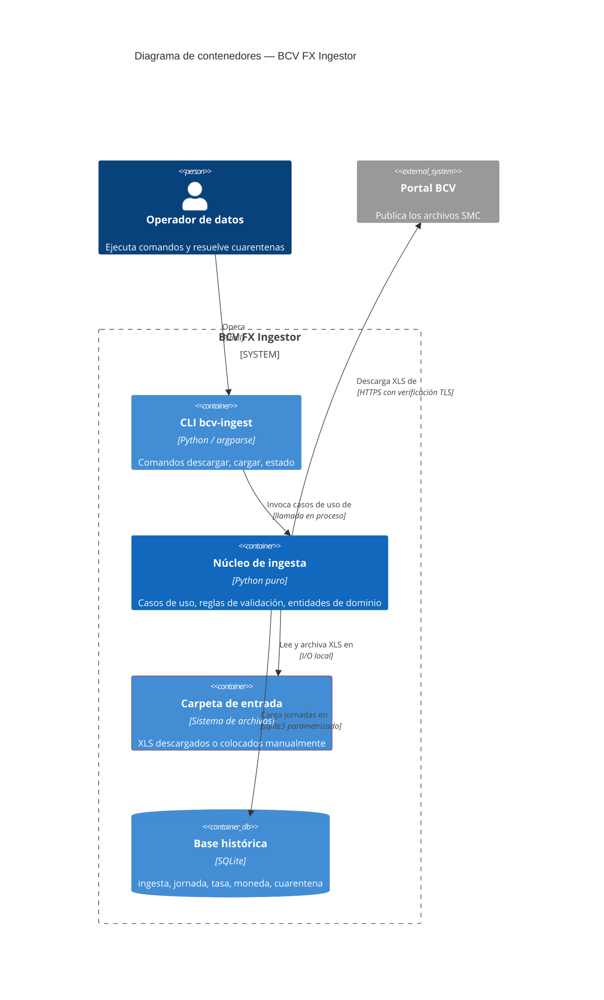
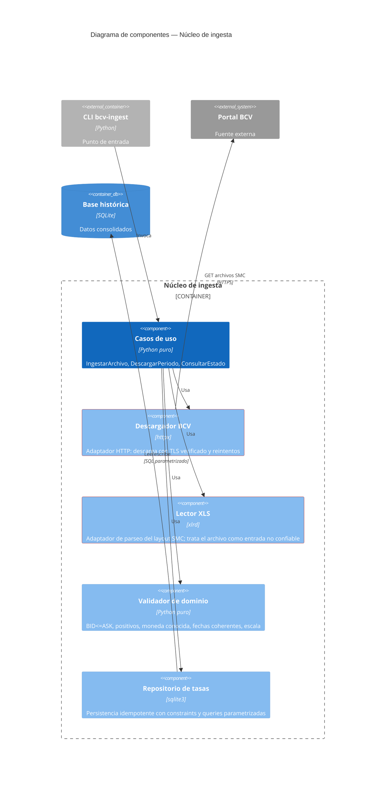
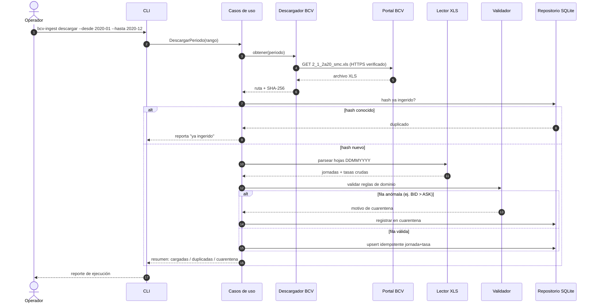
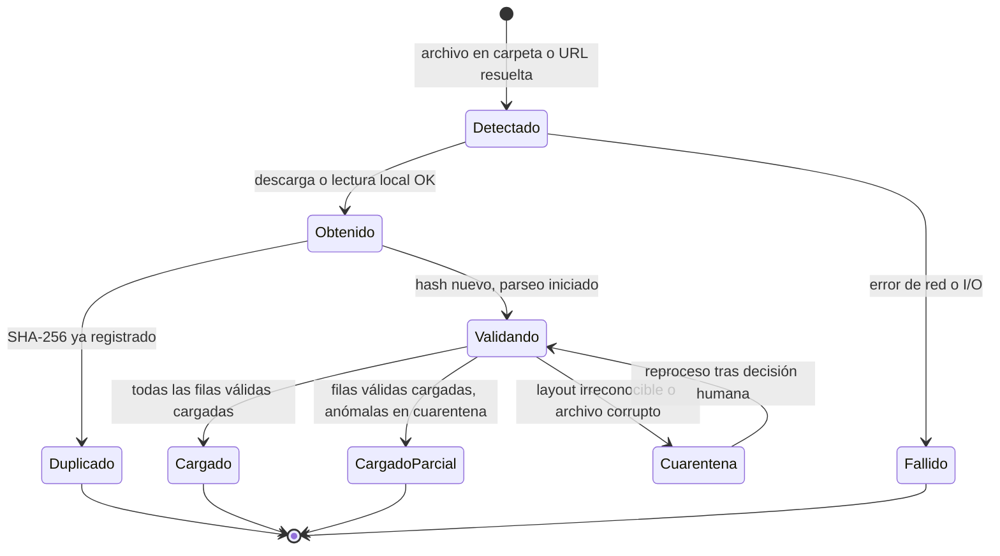
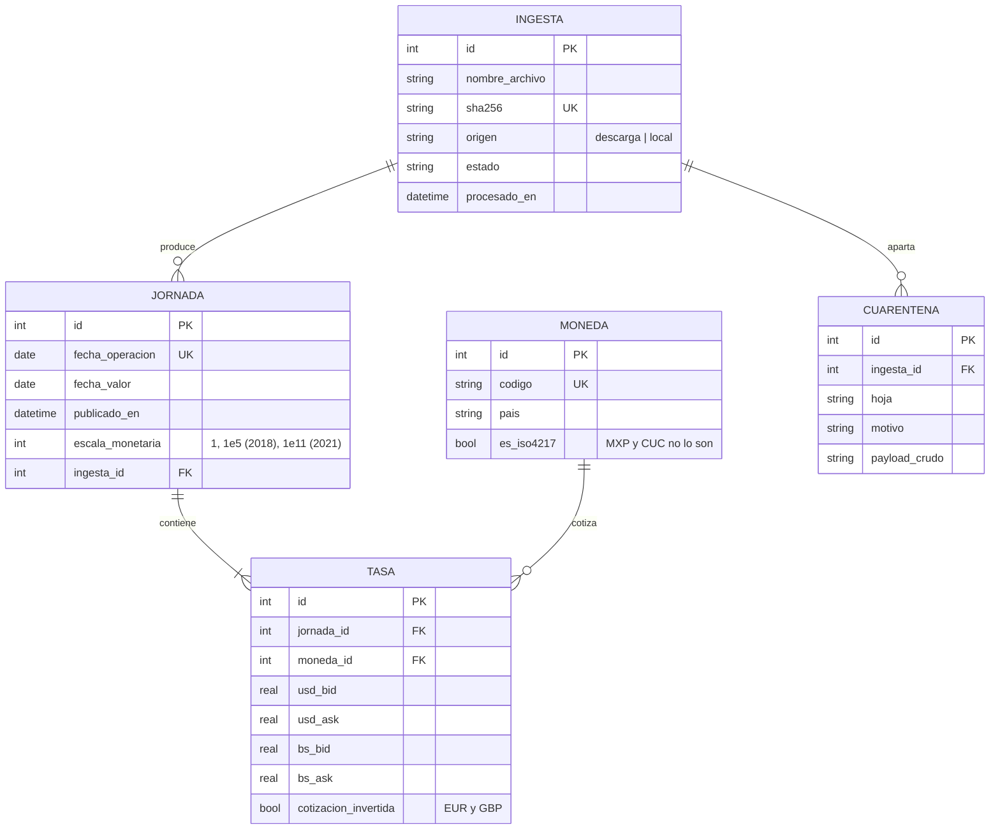

# Diseño del Sistema — BCV FX Ingestor

* **Estado:** review
* **Fecha:** 2026-07-11
* **Decisores:** Jeremi Alcalá
* **Fase AI-DLC:** 02-design
* **Versión:** 0.1.0
* **Gate:** 1
* **Estilo arquitectónico:** Clean / hexagonal (puertos y adaptadores)
* **ADRs relacionadas:** ADR-0001, ADR-0002, ADR-0003

## Contextos acotados (DDD)

| Bounded Context | Responsabilidad | Entidades núcleo |
|---|---|---|
| Ingesta Cambiaria | Obtener, validar y cargar jornadas de tasas de referencia | Ingesta, Jornada, Tasa, Moneda |

## Vista C4 — Container



## Vista C4 — Component (núcleo de ingesta)



Dirección de dependencias (Clean Architecture): `cli → usecases → puertos`; `descargador`, `lector` y `repo` implementan puertos definidos por el núcleo. El dominio no importa xlrd, httpx ni sqlite3.

## Flujos críticos (comportamiento)



## Ciclo de vida de la entidad núcleo (Ingesta)



## Modelo de datos y dominio




## Contratos (CLI + schema SQLite)

No hay API de red: el contrato público es la CLI y el schema de la base.

| Comando | Argumentos | Salida / exit code |
|---|---|---|
| `bcv-ingest descargar` | `--desde AAAA-MM --hasta AAAA-MM [--destino DIR]` | Resumen JSON por archivo; 0 OK, 2 cuarentenas, 3 error de red |
| `bcv-ingest cargar` | `RUTA` (archivo `.xls` o carpeta) | Resumen JSON: cargadas/duplicadas/cuarentena; 0 OK, 2 cuarentenas |
| `bcv-ingest estado` | `[--jornada AAAA-MM-DD]` | Estado de ingestas y cuarentenas pendientes; 0 siempre |

```sql
CREATE TABLE ingesta (
  id INTEGER PRIMARY KEY,
  nombre_archivo TEXT NOT NULL,
  sha256 TEXT NOT NULL UNIQUE,
  origen TEXT NOT NULL CHECK (origen IN ('descarga','local')),
  estado TEXT NOT NULL,
  procesado_en TEXT NOT NULL DEFAULT (datetime('now'))
);
CREATE TABLE moneda (
  id INTEGER PRIMARY KEY,
  codigo TEXT NOT NULL UNIQUE,
  pais TEXT NOT NULL,
  es_iso4217 INTEGER NOT NULL DEFAULT 1
);
CREATE TABLE jornada (
  id INTEGER PRIMARY KEY,
  fecha_operacion TEXT NOT NULL UNIQUE,
  fecha_valor TEXT NOT NULL,
  publicado_en TEXT,
  escala_monetaria INTEGER NOT NULL DEFAULT 1,
  ingesta_id INTEGER NOT NULL REFERENCES ingesta(id),
  CHECK (fecha_valor >= fecha_operacion)
);
CREATE TABLE tasa (
  id INTEGER PRIMARY KEY,
  jornada_id INTEGER NOT NULL REFERENCES jornada(id),
  moneda_id INTEGER NOT NULL REFERENCES moneda(id),
  usd_bid REAL NOT NULL CHECK (usd_bid > 0),
  usd_ask REAL NOT NULL CHECK (usd_ask > 0),
  bs_bid REAL NOT NULL CHECK (bs_bid > 0),
  bs_ask REAL NOT NULL CHECK (bs_ask > 0),
  cotizacion_invertida INTEGER NOT NULL DEFAULT 0,
  UNIQUE (jornada_id, moneda_id)
);
CREATE TABLE cuarentena (
  id INTEGER PRIMARY KEY,
  ingesta_id INTEGER NOT NULL REFERENCES ingesta(id),
  hoja TEXT,
  motivo TEXT NOT NULL,
  payload_crudo TEXT,
  creado_en TEXT NOT NULL DEFAULT (datetime('now'))
);
```

Nota: `BID <= ASK` se valida en el Validador (no como CHECK) porque la fuente contiene violaciones reales que deben ir a cuarentena con contexto, no fallar la transacción.

## Patrones de seguridad seleccionados (por amenaza DREAD priorizada)

| Amenaza | Patrón / Control | OWASP |
|---|---|---|
| T1 Cambio de layout silencioso | Parser con contrato explícito (posiciones + encabezados verificados); si no coincide → cuarentena, nunca "mejor esfuerzo" | A08 |
| T3 Datos fuente erróneos | Validación de dominio + cuarentena trazable (evidencia: CHF 31/03/2020) | A08 |
| T2 Suplantación de fuente | HTTPS con verificación estricta; hash SHA-256 registrado; excepción TLS solo por decisión humana documentada | A02 |
| T4 Re-ingesta duplicada/alterada | Idempotencia por constraints (UNIQUE sha256, UNIQUE jornada+moneda) | A08 |
| T5 XLS malicioso | xlrd sin macros; límites de tamaño/filas; ingesta en proceso sin privilegios | A03/A08 |
| T6 Inyección SQL | Solo queries parametrizadas (sqlite3 placeholders) | A03 |
| T7 Mezcla de escalas | Campo `escala_monetaria` por jornada + tabla de vigencia de redenominaciones | A08 |
