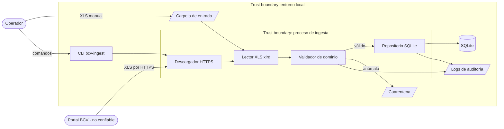
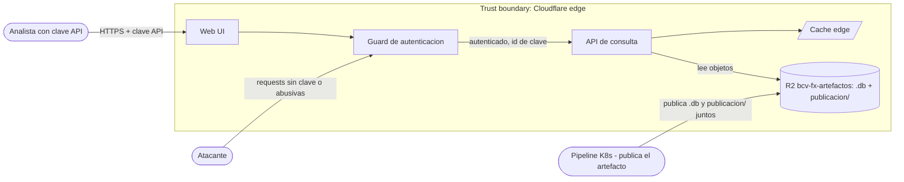
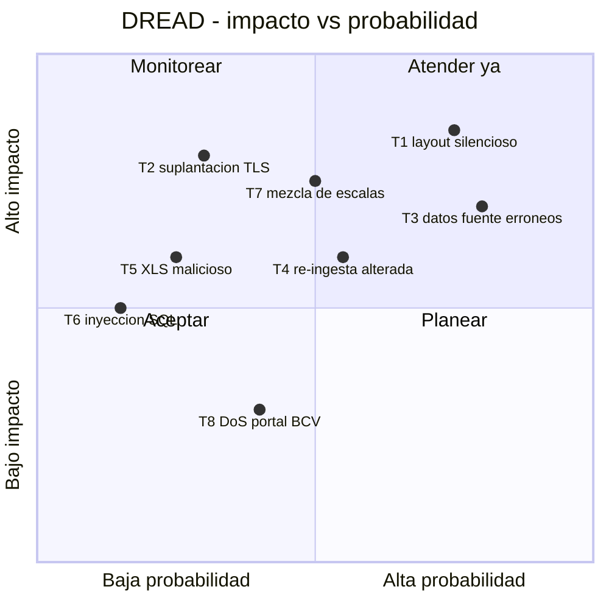
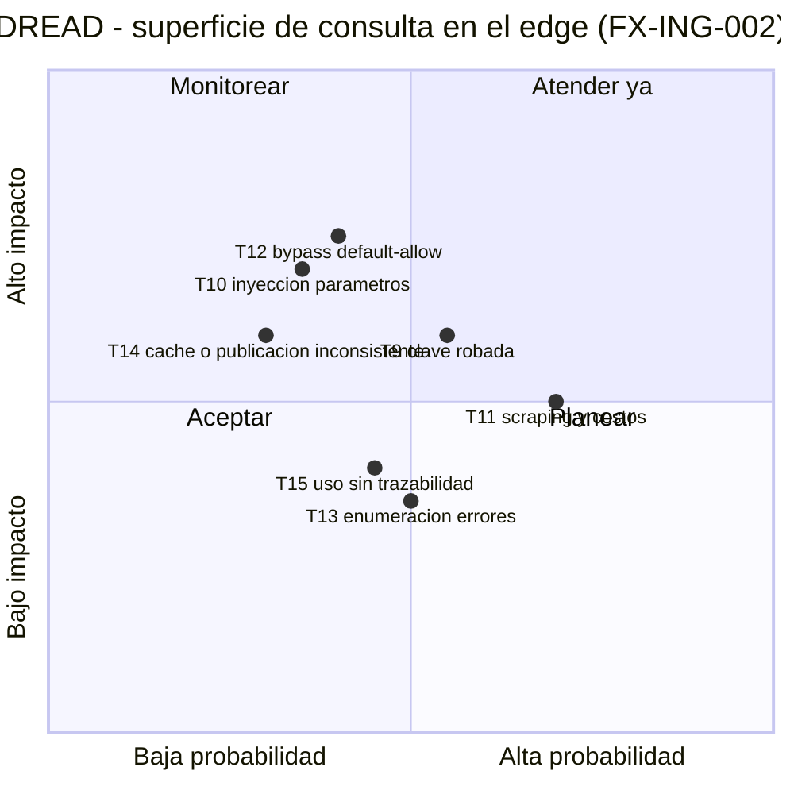

# Threat Model — BCV FX Ingestor

* **Estado:** approved
* **Fecha:** 2026-07-14
* **Decisores:** Jeremi Alcalá
* **Fase AI-DLC:** 02-design
* **Versión:** 0.5.0
* **Gate:** 1
* **Alcance:** sistema completo (CLI, núcleo, descarga, SQLite) + superficie de consulta en el edge (FX-ING-002)
* **Metodología:** STRIDE + DREAD

> *(Actualización 2026-07-14, FX-ING-002: se añade la superficie de consulta del edge — §DFD del edge, filas STRIDE nuevas y amenazas T9–T15. Las T1–T8 de la ingesta permanecen como fueron aprobadas. Gate 1 del feature aprobado el 2026-07-14; el doc vuelve a `approved`. Las T1–T7 locales del PRD `consulta-descarga-fx.md` corresponden aquí a T9–T15.)*
* **Clasificación de datos (ref):** `docs/00-project/data-classification.md`

Activo principal a proteger: la **integridad** de la serie histórica (datos públicos: la confidencialidad es secundaria).

## Diagrama de flujo de datos (DFD)

Cruces de trust boundary: (1) BCV→Descargador (red externa), (2) Operador→Carpeta de entrada (archivos arbitrarios), (3) Lector XLS (contenido no confiable entra al proceso).

## DFD — superficie de consulta en el edge (FX-ING-002)

Cruces de trust boundary del edge: (4) Analista/Atacante→Guard (Internet entra al Worker), (5) Pipeline→R2 (publicación desde K8s — flujo ya cubierto por T2/T4 y ADR-0006), (6) Cache edge→clientes (respuestas compartidas).

## Análisis STRIDE

| Componente | Spoofing | Tampering | Repudiation | Info Disclosure | DoS | Elevation |
| --- | --- | --- | --- | --- | --- | --- |
| Descargador HTTPS | Suplantación del portal BCV (T2) | XLS alterado en tránsito (T2) | Sin registro de origen/hash (RS04) | — | Portal caído / throttling (T8) | — |
| Carpeta de entrada | Archivo con nombre oficial pero contenido ajeno (T4) | Reemplazo de archivo ya ingerido (T4) | ¿Quién colocó el archivo? → log | — | Carpeta inundada de archivos | — |
| Lector XLS (xlrd) | — | Layout manipulado carga datos corridos (T1) | — | Metadatos OLE con nombres de personas | Bomba de celdas / BIFF corrupto (T5) | Explotación de bug del parser (T5) |
| Validador | — | Reglas laxas dejan pasar datos erróneos (T3) | Cuarentena sin motivo trazable | — | — | — |
| Repositorio SQLite | — | Inyección SQL vía celdas (T6); escritura no idempotente (T4) | Cargas sin auditoría | — | BD bloqueada por procesos concurrentes | — |
| Serie histórica (dato) | — | Mezcla de escalas por redenominación (T7) | — | — | — | — |
| Guard de autenticación (edge) | Clave robada usada por un tercero (T9) | — | Accesos sin id de clave en logs (T15) | Comparación no constante filtra la clave por timing | — | Ruta sin guard por default-allow (T12) |
| API de consulta (edge) | — | Parámetros manipulados / mapeo a objetos fuera del contrato (T10) | — | Errores verbosos revelan estructura interna (T13) | Scraping masivo, rangos/páginas sin tope (T11) | — |
| Cache edge | — | Respuesta autenticada servida desde caché compartida (T14) | — | Respuesta de otro cliente expuesta vía cache key con credenciales (T14) | — | — |
| Publicación R2 (`publicacion/`) | — | Deriva entre `.db` y JSON precalculado (T14); objeto adulterado sin traza | — | — | Publicación incompleta deja 404 parciales | — |
| Web UI | — | — | — | Clave incrustada en el código de la UI (prohibido por RF15) | — | — |

## Amenazas priorizadas (DREAD)

Escala 1–10 por dimensión; Score = promedio.

| ID | Amenaza | D | R | E | A | D | Score | Control / ADR |
| --- | --- | --- | --- | --- | --- | --- | --- | --- |
| T1 | Cambio de layout del XLS carga datos corridos sin error | 9 | 9 | 7 | 8 | 6 | 7.8 | Contrato de layout verificado + cuarentena (ADR-0003) |
| T3 | Datos erróneos de la fuente cargados como válidos (caso CHF) | 8 | 10 | 8 | 8 | 5 | 7.8 | Validador BID≤ASK, rangos, desviación (ADR-0003) |
| T7 | Series con escalas mezcladas por redenominación | 8 | 8 | 6 | 8 | 5 | 7.0 | `escala_monetaria` por jornada (architecture.md) |
| T2 | Suplantación del portal BCV / MITM en descarga | 9 | 4 | 5 | 8 | 6 | 6.4 | TLS estricto con fallo cerrado, sin excepciones (ADR-0004) + SHA-256 registrado (RS01) |
| T4 | Re-ingesta de archivo alterado con mismo nombre | 7 | 6 | 6 | 7 | 5 | 6.2 | UNIQUE sha256 + UNIQUE jornada/moneda (ADR-0002) |
| T5 | XLS malicioso explota el parser | 8 | 3 | 4 | 7 | 5 | 5.4 | xlrd sin macros, límites, proceso sin privilegios (RS02) |
| T6 | Inyección SQL vía contenido de celdas | 6 | 3 | 4 | 6 | 4 | 4.6 | Queries parametrizadas (RS03) |
| T8 | Indisponibilidad/throttling del portal BCV | 3 | 6 | 8 | 4 | 8 | 5.8 | Reintentos con backoff, modo local como respaldo (ADR-0002) |
| T9 | Clave API robada/filtrada usada por un tercero | 6 | 8 | 7 | 6 | 5 | 6.4 | Secret en Wrangler + header-only + rotación/revocación (RS07); auditoría por id de clave (RS11) |
| T10 | Inyección/manipulación de parámetros de consulta | 7 | 6 | 5 | 7 | 5 | 6.0 | Allowlist + mapeo cerrado a claves de objeto, sin motor SQL en el edge (RS08, ADR-0007) |
| T11 | Scraping masivo / DoS que degrada y encarece el edge | 5 | 8 | 8 | 6 | 7 | 6.8 | Rate limiting de plataforma + topes de página/respuesta (RS09, ADR-0008) |
| T12 | Bypass de autenticación por ruta sin guard (default-allow) | 7 | 7 | 5 | 7 | 6 | 6.4 | Guard default-deny sobre `/api/*`, tiempo constante (RS06) |
| T13 | Enumeración de rutas / fugas por errores verbosos | 4 | 7 | 7 | 5 | 4 | 5.4 | Errores uniformes sin detalles internos (RS10 headers, contrato OpenAPI) |
| T14 | Caché compartida con respuestas autenticadas o publicación inconsistente con el `.db` | 6 | 5 | 4 | 7 | 5 | 5.4 | Cache key sin credenciales + `cache-control` explícito (RS10); publicación conjunta con `sha256` común (ADR-0007) |
| T15 | Uso del servicio sin trazabilidad por clave (repudio) | 4 | 6 | 6 | 5 | 4 | 5.0 | Log de acceso/rechazo con identificador de clave (RS11) |

## Controles y trazabilidad

* Cada amenaza ≥ 6.0 tiene control en `architecture.md` §Patrones de seguridad y ADR asociada; ninguna queda sin dueño.
* Decisión HITL (2026-07-11, Jeremi Alcalá): ante certificado TLS inválido del portal BCV el proceso **falla siempre**; no existe flag `--inseguro` ni vía de excepción. Respaldo operativo: modo local. Ver ADR-0004.
  * Evidencia (2026-07-11): el certificado actual de `www.bcv.org.ve` valida correctamente contra el almacén de confianza del sistema (verificado con HEAD sobre HTTPS sin excepciones).
  * Evidencia (2026-07-12): el servidor del BCV envía una cadena TLS incompleta (intermedio de otra CA); el bundle certifi no valida pero el almacén del SO sí (resuelve el intermedio vía AIA). El descargador valida contra el almacén del SO con `truststore`, manteniendo la política de fallo cerrado — ver nota de implementación en ADR-0004.
* T8 se acepta parcialmente (riesgo operativo, no de seguridad); mitigación por modo local.
* FX-ING-002 (2026-07-14): T9–T15 con control trazable en `architecture.md` §Patrones de seguridad y ADR-0007/ADR-0008; ninguna ≥ 6.0 queda sin dueño (T9, T10, T11, T12 cubiertas). El umbral del rate limiting vive en configuración de plataforma — el runbook de despliegue debe documentarlo y verificarlo (deuda anotada en ADR-0008, se salda en la fase de implementación).
