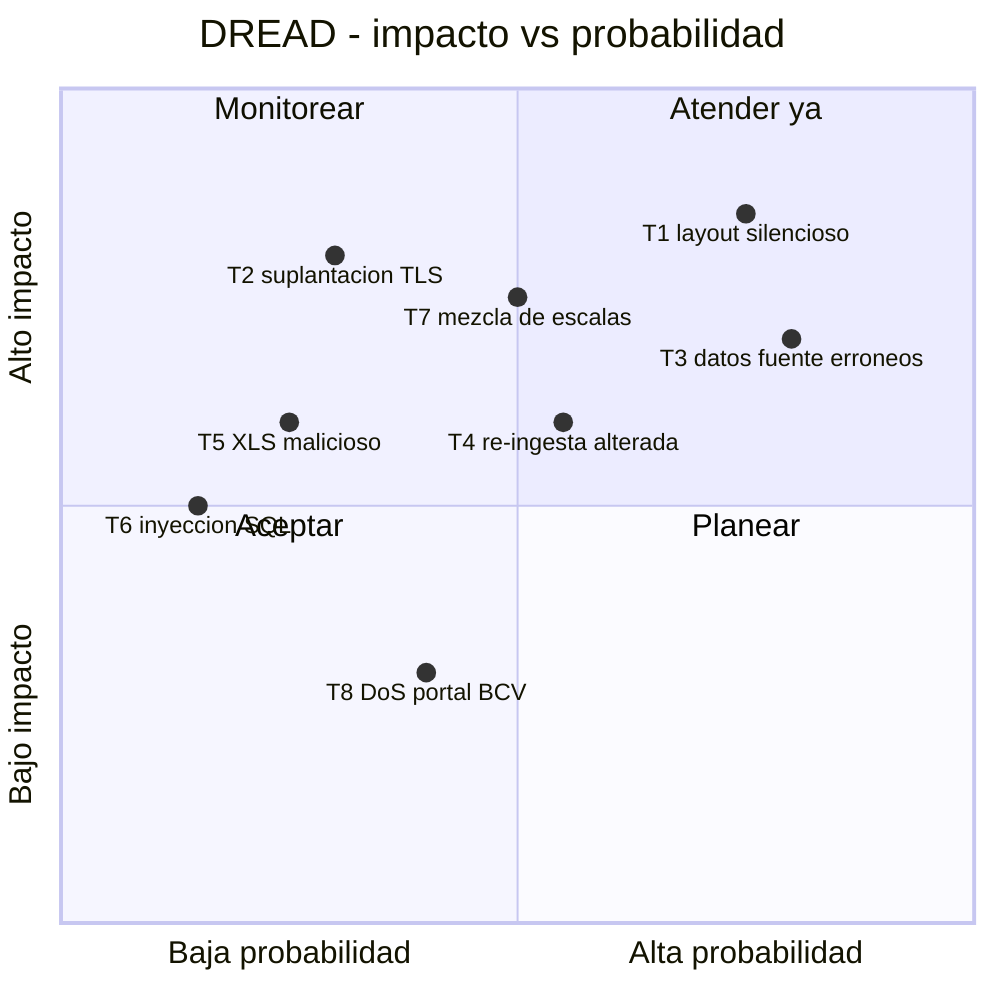

# Threat Model — BCV FX Ingestor

* **Estado:** review
* **Fecha:** 2026-07-11
* **Decisores:** Jeremi Alcalá
* **Fase AI-DLC:** 02-design
* **Versión:** 0.1.0
* **Gate:** 1
* **Alcance:** sistema completo (CLI, núcleo, descarga, SQLite)
* **Metodología:** STRIDE + DREAD
* **Clasificación de datos (ref):** `docs/00-project/data-classification.md`

Activo principal a proteger: la **integridad** de la serie histórica (datos públicos: la confidencialidad es secundaria).

## Diagrama de flujo de datos (DFD)

Cruces de trust boundary: (1) BCV→Descargador (red externa), (2) Operador→Carpeta de entrada (archivos arbitrarios), (3) Lector XLS (contenido no confiable entra al proceso).

## Análisis STRIDE

| Componente | Spoofing | Tampering | Repudiation | Info Disclosure | DoS | Elevation |
|---|---|---|---|---|---|---|
| Descargador HTTPS | Suplantación del portal BCV (T2) | XLS alterado en tránsito (T2) | Sin registro de origen/hash (RS04) | — | Portal caído / throttling (T8) | — |
| Carpeta de entrada | Archivo con nombre oficial pero contenido ajeno (T4) | Reemplazo de archivo ya ingerido (T4) | ¿Quién colocó el archivo? → log | — | Carpeta inundada de archivos | — |
| Lector XLS (xlrd) | — | Layout manipulado carga datos corridos (T1) | — | Metadatos OLE con nombres de personas | Bomba de celdas / BIFF corrupto (T5) | Explotación de bug del parser (T5) |
| Validador | — | Reglas laxas dejan pasar datos erróneos (T3) | Cuarentena sin motivo trazable | — | — | — |
| Repositorio SQLite | — | Inyección SQL vía celdas (T6); escritura no idempotente (T4) | Cargas sin auditoría | — | BD bloqueada por procesos concurrentes | — |
| Serie histórica (dato) | — | Mezcla de escalas por redenominación (T7) | — | — | — | — |

## Amenazas priorizadas (DREAD)

Escala 1–10 por dimensión; Score = promedio.

| ID | Amenaza | D | R | E | A | D | Score | Control / ADR |
|---|---|---|---|---|---|---|---|---|
| T1 | Cambio de layout del XLS carga datos corridos sin error | 9 | 9 | 7 | 8 | 6 | 7.8 | Contrato de layout verificado + cuarentena (ADR-0003) |
| T3 | Datos erróneos de la fuente cargados como válidos (caso CHF) | 8 | 10 | 8 | 8 | 5 | 7.8 | Validador BID≤ASK, rangos, desviación (ADR-0003) |
| T7 | Series con escalas mezcladas por redenominación | 8 | 8 | 6 | 8 | 5 | 7.0 | `escala_monetaria` por jornada (architecture.md) |
| T2 | Suplantación del portal BCV / MITM en descarga | 9 | 4 | 5 | 8 | 6 | 6.4 | TLS estricto con fallo cerrado, sin excepciones (ADR-0004) + SHA-256 registrado (RS01) |
| T4 | Re-ingesta de archivo alterado con mismo nombre | 7 | 6 | 6 | 7 | 5 | 6.2 | UNIQUE sha256 + UNIQUE jornada/moneda (ADR-0002) |
| T5 | XLS malicioso explota el parser | 8 | 3 | 4 | 7 | 5 | 5.4 | xlrd sin macros, límites, proceso sin privilegios (RS02) |
| T6 | Inyección SQL vía contenido de celdas | 6 | 3 | 4 | 6 | 4 | 4.6 | Queries parametrizadas (RS03) |
| T8 | Indisponibilidad/throttling del portal BCV | 3 | 6 | 8 | 4 | 8 | 5.8 | Reintentos con backoff, modo local como respaldo (ADR-0002) |

## Controles y trazabilidad

- Cada amenaza ≥ 6.0 tiene control en `architecture.md` §Patrones de seguridad y ADR asociada; ninguna queda sin dueño.
- Decisión HITL (2026-07-11, Jeremi Alcalá): ante certificado TLS inválido del portal BCV el proceso **falla siempre**; no existe flag `--inseguro` ni vía de excepción. Respaldo operativo: modo local. Ver ADR-0004.
  - Evidencia (2026-07-11): el certificado actual de `www.bcv.org.ve` valida correctamente contra el almacén de confianza del sistema (verificado con HEAD sobre HTTPS sin excepciones).
- T8 se acepta parcialmente (riesgo operativo, no de seguridad); mitigación por modo local.
