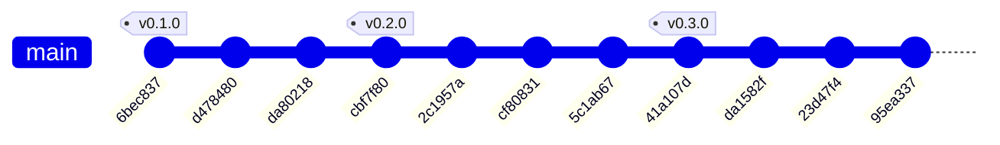

# Historial de implementación — BCV FX Ingestor

* **Estado:** approved
* **Fecha:** 2026-07-12
* **Decisores:** Jeremi Alcalá
* **Fase AI-DLC:** 03-implementation
* **Versión:** 0.3.0
* **Gate:** 2
* **Rama principal:** main
* **Estrategia de branching:** trunk-based

## Historial del repositorio (documentación viva)

Derivado de `git log` con `scripts/gitgraph_from_log.py`. Regenerar tras cada merge o tag para
mantener la traza sincronizada. Los tags SemVer enlazan con las versiones del `CHANGELOG.md`.

### Grafo de commits y merges

### Bitácora de cambios (fiel al repo)

| Commit | Tipo | Tags | Autor | Fecha | Mensaje |
|---|---|---|---|---|---|
| `95ea337` | commit | — | Jeremi Alcala | 2026-07-12 | fix: recalibrar la regla de coherencia de spread de RF04 contra el corpus completo |
| `23d47f4` | commit | — | Jeremi Alcala | 2026-07-12 | chore: excluir .coverage del repositorio |
| `da1582f` | commit | — | Jeremi Alcala | 2026-07-12 | docs: auditoría AI-DLC — documentación viva de fase 03, versiones sincronizadas y hallazgos SAST corregidos |
| `41a107d` | commit | v0.3.0 | Jeremi Alcala | 2026-07-12 | docs: aprobar Gate 2 y cortar versión 0.3.0 |
| `5c1ab67` | commit | — | Jeremi Alcala | 2026-07-12 | feat: implementación de la fase 03 — ingestor completo con CLI y pirámide de tests |
| `cf80831` | commit | — | Jeremi Alcala | 2026-07-12 | docs: mejorar claridad y formato en la sección de alcance del proyecto |
| `2c1957a` | commit | — | Jeremi Alcala | 2026-07-12 | docs: corregir formato de tabla en la clasificación de datos |
| `cbf7f80` | commit | v0.2.0 | Jeremi Alcala | 2026-07-11 | docs: aprobar gates 0 y 1 y cortar versión 0.2.0 |
| `da80218` | commit | — | Jeremi Alcala | 2026-07-11 | docs: actualizar changelog y documentación sobre política TLS estricta sin excepciones |
| `d478480` | commit | — | Jeremi Alcala | 2026-07-11 | docs: confirmar patrón de URLs de descarga del BCV |
| `6bec837` | commit | v0.1.0 | Jeremi Alcala | 2026-07-11 | docs: documentación inicial AI-DLC (fases 00–02, gates 0 y 1 en review) |

## Trazabilidad tag ↔ versión ↔ decisión

| Tag | Versión CHANGELOG | ADR / feature | Nota |
|---|---|---|---|
| v0.1.0 | 0.1.0 (Gate 0) | FX-ING-001 (PRD) | charter, glosario, clasificación de datos, PRD |
| v0.2.0 | 0.2.0 (Gate 1) | ADR-0001 · ADR-0002 · ADR-0003 · ADR-0004 | diseño, threat model, patrón de URLs confirmado, decisión TLS |
| v0.3.0 | 0.3.0 (Gate 2) | ADR-0002/0003/0004 implementadas | ingestor completo, RF04 refinado (spread entre bases), truststore |
