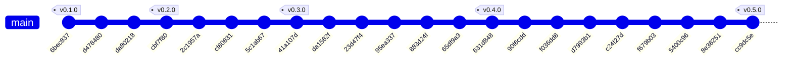

# Historial de implementación — BCV FX Ingestor

* **Estado:** approved
* **Fecha:** 2026-07-12
* **Decisores:** Jeremi Alcalá
* **Fase AI-DLC:** 03-implementation
* **Versión:** 0.5.0
* **Gate:** 2
* **Rama principal:** main
* **Estrategia de branching:** trunk-based

## Historial del repositorio (documentación viva)

Derivado de `git log` con `scripts/gitgraph_from_log.py`. Regenerar tras cada merge o tag para
mantener la traza sincronizada. Los tags SemVer enlazan con las versiones del `CHANGELOG.md`.

### Grafo de commits y merges

### Bitácora de cambios (fiel al repo)

| Commit | Tipo | Tags | Autor | Fecha | Mensaje |
|---|---|---|---|---|---|
| `cc9dc5e` | commit | v0.5.0 | Jeremi Alcala | 2026-07-12 | docs: aprobar Gate 4 y cortar versión 0.5.0 |
| `8e38251` | commit | — | Jeremi Alcala | 2026-07-12 | docs: registrar la corrida verde del smoke como evidencia del Gate 4 |
| `5400c96` | commit | — | Jeremi Alcala | 2026-07-12 | fix(ci): instalar el intermedio de Sectigo en el runner del smoke |
| `f679b03` | commit | — | Jeremi Alcala | 2026-07-12 | docs: registrar la corrida verde del CI como evidencia del Gate 4 |
| `c24f27d` | commit | — | Jeremi Alcala | 2026-07-12 | docs: reaplicar cabecera y trazabilidad al historial vivo |
| `d7993b1` | commit | — | Jeremi Alcala | 2026-07-12 | fix(ci): corregir referencia de trivy-action y regenerar historial vivo |
| `f036dd8` | commit | — | Jeremi Alcala | 2026-07-12 | feat: fase 05-deployment — CI con gates de seguridad y despliegue multinube edge-first |
| `90f6cdd` | commit | — | Jeremi Alcala | 2026-07-12 | docs: regenerar historial vivo tras el tag v0.4.0 |
| `631d848` | commit | v0.4.0 | Jeremi Alcala | 2026-07-12 | docs: aprobar Gate 3 y cortar versión 0.4.0 |
| `65df9a3` | commit | — | Jeremi Alcala | 2026-07-12 | test: cerrar las brechas de la evaluación del Gate 3 |
| `883d24f` | commit | — | Jeremi Alcala | 2026-07-12 | test: fase 04-testing hacia el Gate 3 — estrategia, matriz de transiciones y trazabilidad requisito↔test. |
| `95ea337` | commit | — | Jeremi Alcala | 2026-07-12 | fix: recalibrar la regla de coherencia de spread de RF04 contra el corpus completo |
| `23d47f4` | commit | — | Jeremi Alcala | 2026-07-12 | chore: excluir .coverage del repositorio |
| `da1582f` | commit | — | Jeremi Alcala | 2026-07-12 | docs: auditoría AI-DLC — documentación viva de fase 03, versiones sincronizadas y hallazgos SAST corregidos |
| `41a107d` | commit | v0.3.0 | Jeremi Alcala | 2026-07-12 | docs: aprobar Gate 2 y cortar versión 0.3.0 |
| `5c1ab67` | commit | — | Jeremi Alcala | 2026-07-12 | feat: implementación de la fase 03 — ingestor completo con CLI y pirámide de tests |
| `cf80831` | commit | — | Jeremi Alcala | 2026-07-12 | docs: mejorar claridad y formato en la sección de alcance del proyecto |
| `2c1957a` | commit | — | Jeremi Alcala | 2026-07-12 | docs: corregir formato de tabla en la clasificación de datos |
| `cbf7f80` | commit | v0.2.0 | Jeremi Alcala | 2026-07-11 | docs: aprobar gates 0 y 1 y cortar versión 0.2.0 |
| `da80218` | commit | — | Jeremi Alcala | 2026-07-11 | docs: actualizar changelog y documentación sobre política TLS estricta sin excepciones |
| `d478480` | commit | — | Jeremi Alcala | 2026-07-11 | docs: confirmar patrón de URLs de descarga del BCV |
| `6bec837` | commit | v0.1.0 | Jeremi Alcala | 2026-07-11 | docs: documentación inicial AI-DLC (fases 00–02, gates 0 y 1 en review) |

## Trazabilidad tag ↔ versión ↔ decisión

| Tag | Versión CHANGELOG | ADR / feature | Nota |
|---|---|---|---|
| v0.1.0 | 0.1.0 (Gate 0) | FX-ING-001 (PRD) | charter, glosario, clasificación de datos, PRD |
| v0.2.0 | 0.2.0 (Gate 1) | ADR-0001 · ADR-0002 · ADR-0003 · ADR-0004 | diseño, threat model, patrón de URLs confirmado, decisión TLS |
| v0.3.0 | 0.3.0 (Gate 2) | ADR-0002/0003/0004 implementadas | ingestor completo, RF04 refinado (spread entre bases), truststore |
| v0.4.0 | 0.4.0 (Gate 3) | FX-ING-001 verificada (RF/RNF/RS ↔ tests) | estrategia de pruebas, matriz de transiciones, RF04 recalibrado con el corpus, 78 tests / 99% |
| v0.5.0 | 0.5.0 (Gate 4) | ADR-0005 · ADR-0006 | CI con gates de seguridad, imagen GHCR, K8s EKS/GKE, Worker R2; intermedio Sectigo vendorizado |
