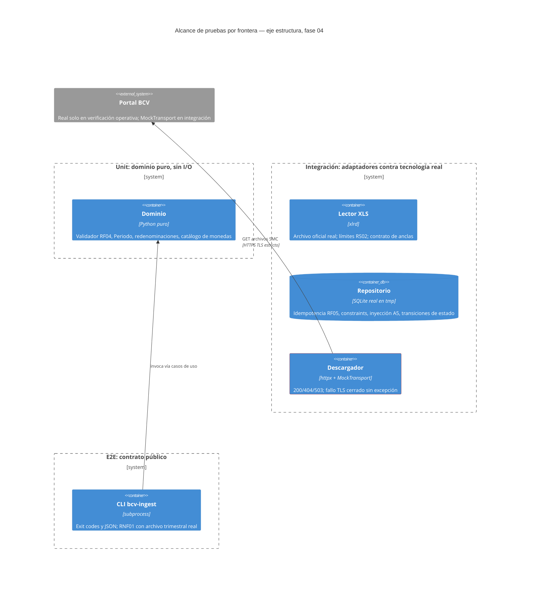
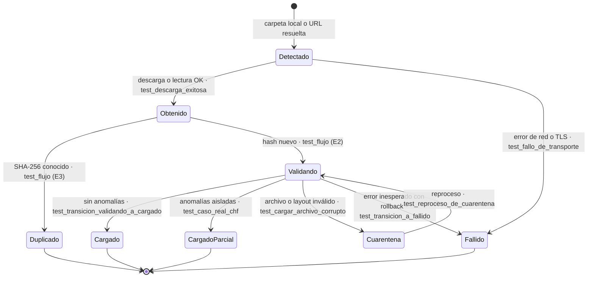

# Estrategia de Pruebas — BCV FX Ingestor

* **Estado:** review
* **Fecha:** 2026-07-12
* **Decisores:** Jeremi Alcalá
* **Fase AI-DLC:** 04-testing
* **Versión:** 0.4.0
* **Gate:** 3
* **Pirámide:** 27 unit · 28 integración · 4 e2e (59 tests, cobertura 94%)
* **SLO de rendimiento (ref):** RNF01 — archivo trimestral < 30 s

## Pirámide y fronteras (¿qué es real y qué es mock?)

Principio: **mock solo en la frontera de red**; todo lo demás se prueba contra lo real —
el dominio es puro, SQLite es real en disco temporal y el parser se ejercita con el
archivo oficial del BCV como fixture (`tests/fixtures/2_1_2a20_smc.xls`, sha256 `c62e6e43…`).

| Nivel | Frontera | Real | Simulado | Tests |
|---|---|---|---|---|
| Unit | Dominio puro (validador, períodos, redenominaciones, catálogo) | Reglas con valores reales del corpus (CHF, ANG, BOB) | nada | 27 |
| Integración | Adaptadores contra sus tecnologías | xlrd + archivo oficial; SQLite real (constraints, FK, inyección); casos de uso con repositorio real | `httpx.MockTransport` (200/404/503/error TLS); `LectorFalso` para transiciones de estado | 28 |
| E2E / contrato | CLI como proceso (`subprocess`) | Exit codes 0/2/3 y JSON del contrato, archivo oficial real | nada | 4 |
| Operativa | Portal BCV real | Descarga del corpus completo (27 archivos), TLS estricto, 404 limpio | — | evidencia en Gate 2/3 |

El borde rojo marca la única frontera simulada (transporte HTTP); la política TLS del
adaptador se verificó además contra el portal real (ADR-0004 §Nota de implementación).

## State-transition testing (eje comportamiento)

Mismo ciclo de vida de la entidad Ingesta del diseño (`architecture.md` §stateDiagram),
ahora con cada transición respaldada por un test:

### Matriz de transiciones

| Transición | Test | Nivel |
|---|---|---|
| Detectado → Obtenido | `test_descarga_exitosa_guarda_y_hashea`, `CarpetaLocalAdapter` en flujo de carga | integración |
| Detectado → Fallido | `test_fallo_de_transporte_reintenta_y_falla_cerrado`, `test_http_inesperado` | integración |
| Obtenido → Duplicado | `test_cargar_estado_y_reingesta` (E3), `test_no_redescarga_lo_ya_ingerido_rf01` | e2e / integración |
| Obtenido → Validando | `test_cargar_estado_y_reingesta` (E2) | e2e |
| Validando → Cargado | `test_transicion_validando_a_cargado` | integración |
| Validando → CargadoParcial | `test_cargar_estado_y_reingesta` (fixture real, CHF) | e2e |
| Validando → Cuarentena | `test_cargar_archivo_corrupto_va_a_cuarentena` | e2e |
| Validando → Fallido (rollback) | `test_transicion_a_fallido_revierte_todo` | integración |
| Cuarentena → Validando (reproceso) | `test_reproceso_de_cuarentena_no_acumula_items`, `test_reproceso_tras_cuarentena_reutiliza_la_ingesta` | integración |
| Abuso: re-ingesta alterada (A4) | `test_reingesta_alterada_no_sobreescribe_a4` | integración |

## Trazabilidad requisito ↔ test (eje trazabilidad — cierra el círculo del Gate 0)

```mermaid
requirementDiagram
    requirement RF01 {
      id: RF01
      text: "Descargar por rango sin re-descargar lo ingerido"
      risk: medium
      verifymethod: test
    }
    requirement RF03 {
      id: RF03
      text: "Parsear hojas DDMMYYYY del layout SMC"
      risk: high
      verifymethod: test
    }
    requirement RF04 {
      id: RF04
      text: "Validacion de dominio incl. coherencia de spread"
      risk: high
      verifymethod: test
    }
    requirement RF05 {
      id: RF05
      text: "Carga idempotente por constraints"
      risk: high
      verifymethod: test
    }
    requirement RF06 {
      id: RF06
      text: "Cuarentena trazable sin abortar el lote"
      risk: high
      verifymethod: test
    }
    requirement RF07 {
      id: RF07
      text: "Escala monetaria por jornada"
      risk: medium
      verifymethod: test
    }
    requirement RNF01 {
      id: RNF01
      text: "Archivo trimestral en menos de 30 s"
      risk: low
      verifymethod: test
    }
    requirement RS01 {
      id: RS01
      text: "TLS estricto con fallo cerrado y hash registrado"
      risk: medium
      verifymethod: test
    }
    requirement RS02 {
      id: RS02
      text: "XLS no confiable: limites de tamano, hojas y filas"
      risk: medium
      verifymethod: test
    }
    requirement RS03 {
      id: RS03
      text: "Solo SQL parametrizado"
      risk: medium
      verifymethod: test
    }
    requirement RS04 {
      id: RS04
      text: "Auditoria: hash y log por decision de cuarentena"
      risk: medium
      verifymethod: test
    }
    element TestValidador {
      type: "prueba"
      docref: "tests/unit/test_validador.py"
    }
    element TestRedenominaciones {
      type: "prueba"
      docref: "tests/unit/test_redenominaciones.py"
    }
    element TestLectorXls {
      type: "prueba"
      docref: "tests/integration/test_lector_xls.py"
    }
    element TestRepositorio {
      type: "prueba"
      docref: "tests/integration/test_repositorio_sqlite.py"
    }
    element TestDescargador {
      type: "prueba"
      docref: "tests/integration/test_descargador_http.py"
    }
    element TestDescargarPeriodo {
      type: "prueba"
      docref: "tests/integration/test_descargar_periodo.py"
    }
    element TestIngestarArchivo {
      type: "prueba"
      docref: "tests/integration/test_ingestar_archivo.py"
    }
    element TestCliE2E {
      type: "prueba"
      docref: "tests/e2e/test_cli.py"
    }
    element TestRendimiento {
      type: "prueba"
      docref: "tests/e2e/test_rendimiento.py"
    }
    TestDescargarPeriodo - verifies -> RF01
    TestLectorXls - verifies -> RF03
    TestValidador - verifies -> RF04
    TestRepositorio - verifies -> RF05
    TestIngestarArchivo - verifies -> RF06
    TestRedenominaciones - verifies -> RF07
    TestRendimiento - verifies -> RNF01
    TestDescargador - verifies -> RS01
    TestLectorXls - verifies -> RS02
    TestRepositorio - verifies -> RS03
    TestIngestarArchivo - verifies -> RS04
    TestCliE2E - verifies -> RF06
```

RF02 (ingesta local) y RF08 (reporte de ejecución) se verifican en `test_cli_en_proceso.py`
y `test_cli.py` (carga de carpeta, JSON de resumen y `estado`). RNF02 (sin servicios externos
salvo el portal) y RNF03 (logs auditables) se verifican por inspección de diseño y por
`test_cuarentena_queda_auditada_en_logs_rs04` respectivamente. RS05 (idempotencia por
constraints) la verifica `test_guardar_jornada_es_idempotente_rf05` y, operativamente, la
re-ingesta del corpus completo con 0 filas nuevas.

## Escenarios de abuso del PRD ↔ test

| Abuso | Test |
|---|---|
| A1 — archivo malformado/malicioso | `test_archivo_no_xls_es_ilegible`, `test_cargar_archivo_corrupto`, límites RS02, `test_transicion_a_fallido_revierte_todo` (sin cargas parciales) |
| A2 — suplantación de fuente | `test_fallo_de_transporte_reintenta_y_falla_cerrado` (TLS cerrado, sin bypass) + verificación real contra el portal |
| A3 — datos fuente inconsistentes | `test_caso_real_chf_31_03_2020_va_a_cuarentena` (+ 5 anomalías reales detectadas en el corpus) |
| A4 — re-ingesta manipulada | `test_reingesta_alterada_no_sobreescribe_a4` |
| A5 — inyección vía celdas | `test_cuarentena_con_contenido_hostil_no_inyecta_sql` |
| A6 — mezcla de escalas | `test_escala_monetaria_por_fecha_de_jornada`, `test_redenominaciones` |

## Seguridad dinámica (DAST) — no aplica, con justificación

El sistema no expone superficie de red entrante (CLI local, sin API — ver Gate 1 criterio 5);
no hay endpoint que escanear con DAST. El equivalente dinámico aplicado es: entrada hostil
real al parser (A1/A5), verificación TLS contra el portal real en vivo (la política de fallo
cerrado se disparó y se corrigió el almacén de confianza, ADR-0004) y SAST + auditoría de
dependencias del anexo del Gate 2.

## Rendimiento (SLO RNF01)

Medición real (2026-07-12): `2_1_2c25_smc.xls` (2025-TIII, 63 jornadas, 1.323 tasas) ingiere
en **0.04 s** — 750× por debajo del SLO de 30 s. Test de regresión:
`test_archivo_trimestral_bajo_el_slo_rnf01` (se omite si el corpus no está descargado).
Ingesta del corpus completo (27 archivos, 1.393 jornadas): bien por debajo de un minuto.
