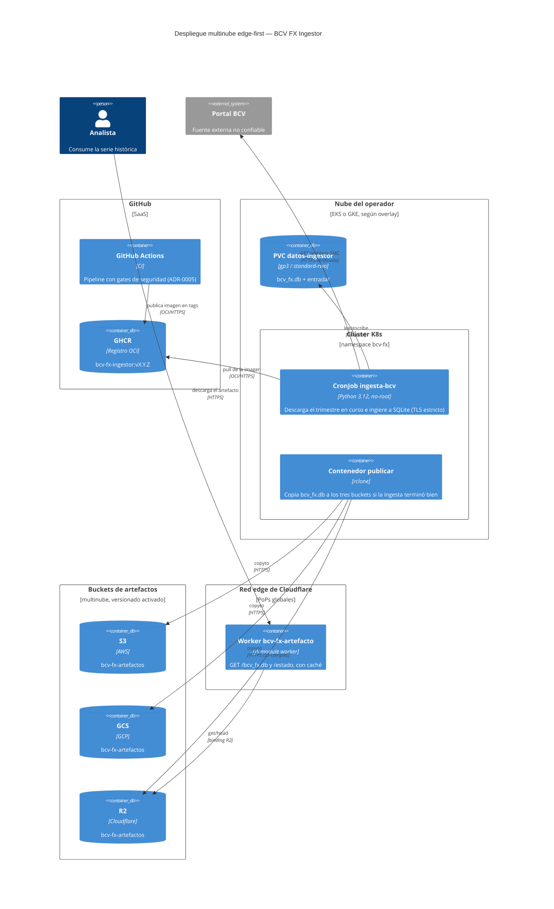
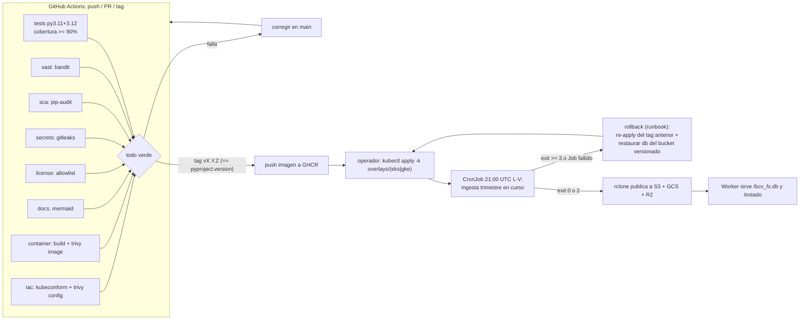
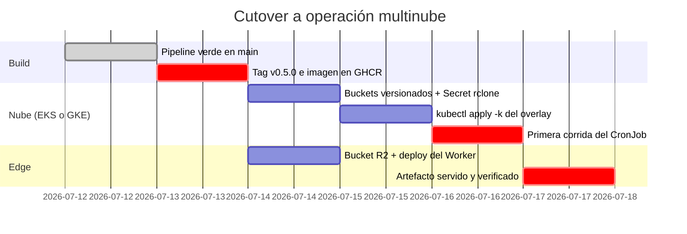

# Despliegue — BCV FX Ingestor

* **Estado:** review
* **Fecha:** 2026-07-12
* **Decisores:** Jeremi Alcalá
* **Fase AI-DLC:** 05-deployment
* **Versión:** 0.5.0
* **Gate:** 4
* **Entorno objetivo:** multinube K8s (EKS/GKE) + edge Cloudflare (R2 + Worker)
* **Estrategia de release:** trunk-based; tag SemVer `vX.Y.Z` → imagen `ghcr.io/jeremialcala/bcv-fx-ingestor`

## Topología (eje estructura)

La ingesta corre como CronJob de K8s en la nube que elija el operador (overlays para EKS y
GKE); el artefacto `bcv_fx.db` se publica a S3, GCS y R2 con una sola herramienta (rclone) y
un Worker de Cloudflare lo sirve desde el edge. No hay API de consulta (no-scope del PRD):
el edge distribuye el archivo, no expone los datos fila a fila.

## Pipeline CI/CD con gates de seguridad (eje comportamiento)

### Mapa de los gates de seguridad ↔ jobs del workflow

| Gate | Job en `ci.yml` | Herramienta | Falla el pipeline si… |
|---|---|---|---|
| SAST | `sast` | bandit | cualquier hallazgo |
| SCA | `sca` | pip-audit | vulnerabilidad conocida en dependencias |
| Secrets | `secrets` | gitleaks (historia completa) | secreto detectado |
| License | `license` | pip-licenses | licencia fuera de la allowlist (MIT/BSD/Apache/PSF/ISC/MPL-2.0) |
| Container | `container` | docker build + Trivy image | vulnerabilidad HIGH/CRITICAL con fix |
| IaC | `iac` | kubeconform (strict) + Trivy config | manifest inválido o misconfiguración HIGH/CRITICAL |
| DAST | — | **N/A justificado**: no hay superficie de red entrante que escanear (CLI + CronJob; el Worker solo sirve un archivo estático desde R2). El equivalente dinámico es el smoke semanal contra el portal real (`smoke.yml`) y los tests de entrada hostil del Gate 3. | — |

Además: `tests` (suite completa, cobertura ≥ 90%) y `docs` (todos los bloques Mermaid válidos).
En tags, el job `container` verifica que `vX.Y.Z` == `pyproject.version` antes de publicar.

## Cutover (eje trazabilidad/plan)

## Runbook

### Despliegue inicial
1. Crear los buckets `bcv-fx-artefactos` en S3, GCS y R2 **con versionado activado** (es la
   base del rollback de datos).
2. Crear el Secret con la configuración de rclone (plantilla en
   `deploy/k8s/base/secret-rclone.example.yaml`):
   `kubectl -n bcv-fx create secret generic rclone-conf --from-file=rclone.conf`.
3. Aplicar el overlay de la nube elegida: `kubectl apply -k deploy/k8s/overlays/eks` (o `gke`).
4. Desplegar el Worker: `cd deploy/cloudflare && npx wrangler deploy`.
5. Primera corrida manual: `kubectl -n bcv-fx create job --from=cronjob/ingesta-bcv ingesta-inicial`.

### Actualización de versión
1. Cortar tag `vX.Y.Z` (== `pyproject.version`); el CI publica la imagen a GHCR.
2. Actualizar el tag de imagen en `deploy/k8s/base/cronjob.yaml` y `kubectl apply -k` del overlay.

### Rollback
- **Imagen**: re-aplicar el overlay con el tag anterior de GHCR (las imágenes de releases
  previos quedan publicadas; no se borran).
- **Datos**: restaurar la versión anterior de `bcv_fx.db` desde el versionado del bucket
  (`aws s3api list-object-versions` / consola GCS / R2) y re-publicarla. La BD es además
  **regenerable desde cero**: la re-ingesta del corpus es idempotente (0 filas duplicadas),
  así que el peor caso es re-correr `bcv-ingest descargar --desde 2020-01 --hasta <hoy>`.
- **Worker**: `npx wrangler rollback` (Cloudflare conserva las versiones anteriores).

### Verificación post-deploy
1. `kubectl -n bcv-fx get jobs` → última corrida `Complete`; logs del initContainer sin
   `exit >= 3` (los exit 2 son cuarentenas: revisar con `bcv-ingest estado`, no bloquean).
2. `curl -sI https://<worker>/bcv_fx.db` → 200 con `etag`; `curl -s https://<worker>/estado`
   → `publicado: true` con `subido` reciente.
3. Descargar el artefacto y verificar: `sqlite3 bcv_fx.db "SELECT COUNT(*) FROM jornada"`.

## Nota TLS del contenedor (hallazgo de esta fase)

Dentro del contenedor Linux la verificación TLS contra el BCV fallaba: el portal envía una
cadena incompleta y OpenSSL —a diferencia del verificador de Windows— no resuelve el
intermedio vía AIA. La imagen añade el **intermedio público de Sectigo** al almacén del
contenedor (`deploy/docker/ca-extra/`, huella SHA-256 documentada). La política de fallo
cerrado (ADR-0004) queda intacta: la cadena sigue teniendo que terminar en una raíz de
confianza; solo se aporta el eslabón que el servidor omite. Si el BCV rota de CA emisora,
actualizar ese certificado (ver README de la carpeta).
