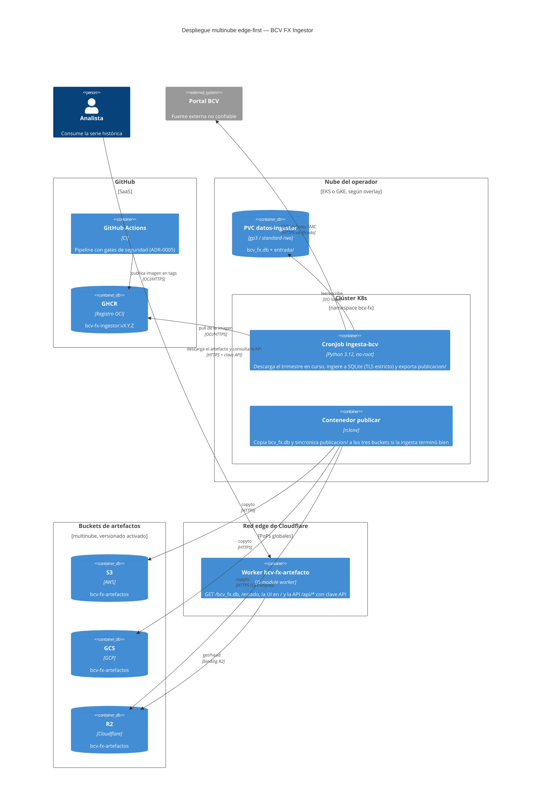
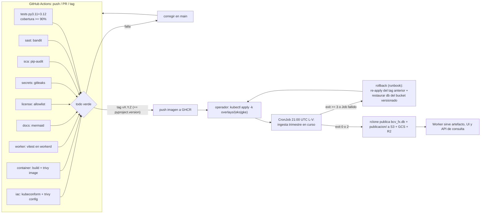
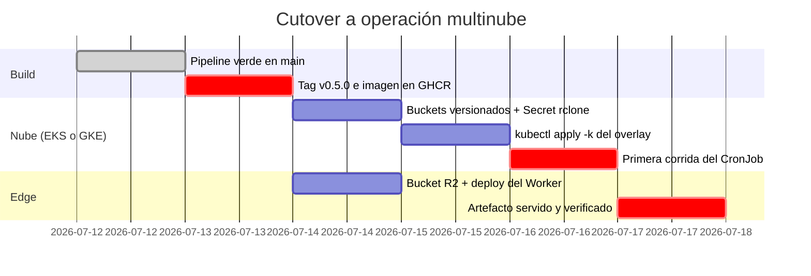

# Despliegue — BCV FX Ingestor

* **Estado:** approved
* **Fecha:** 2026-07-14
* **Decisores:** Jeremi Alcalá
* **Fase AI-DLC:** 05-deployment
* **Versión:** 0.6.0
* **Gate:** 4
* **Entorno objetivo:** multinube K8s (EKS/GKE) + edge Cloudflare (R2 + Worker)
* **Estrategia de release:** gitflow (develop/feature/release; trunk-based hasta v1.0.0); tag SemVer `vX.Y.Z` → imagen `ghcr.io/jeremialcala/bcv-fx-ingestor`

> *(Actualización 2026-07-14, FX-ING-002: el Worker suma la API de consulta autenticada y la
> Web UI —ADR-0007/0008—; el CronJob exporta y publica también `publicacion/`. Runbook
> ampliado: secret `API_KEYS`, regla de rate limiting y verificación de la API.)*

## Topología (eje estructura)

La ingesta corre como CronJob de K8s en la nube que elija el operador (overlays para EKS y
GKE); el artefacto `bcv_fx.db` **y la publicación JSON derivada (`publicacion/`, ADR-0007)**
se publican a S3, GCS y R2 con una sola herramienta (rclone) y un Worker de Cloudflare los
sirve desde el edge: el archivo completo en `/bcv_fx.db` y la consulta fila a fila vía
`/api/*` (autenticada por clave API) con su Web UI en `/` (FX-ING-002).



## Pipeline CI/CD con gates de seguridad (eje comportamiento)



### Mapa de los gates de seguridad ↔ jobs del workflow

| Gate | Job en `ci.yml` | Herramienta | Falla el pipeline si… |
|---|---|---|---|
| SAST | `sast` | bandit | cualquier hallazgo |
| SCA | `sca` | pip-audit | vulnerabilidad conocida en dependencias |
| Secrets | `secrets` | gitleaks (historia completa) | secreto detectado |
| License | `license` | pip-licenses | licencia fuera de la allowlist (MIT/BSD/Apache/PSF/ISC/MPL-2.0) |
| Container | `container` | docker build + Trivy image | vulnerabilidad HIGH/CRITICAL con fix |
| IaC | `iac` | kubeconform (strict) + Trivy config | manifest inválido o misconfiguración HIGH/CRITICAL |
| DAST | — | **Sin scanner dedicado, justificado** *(actualizado 2026-07-14, FX-ING-002)*: la superficie entrante nueva es la API JSON del Worker — sin HTML dinámico ni estado de sesión, default-deny con clave API y mapeo cerrado a objetos R2. Su equivalente dinámico es la suite vitest hostil del job `worker` (401/400/404, payloads, topes, en workerd real) más los curls de la verificación post-deploy; el smoke semanal (`smoke.yml`) cubre el portal externo. Decisión revisable si la superficie crece. | — |

Además: `tests` (suite completa, cobertura ≥ 90%), `worker` (contrato del Worker con vitest en workerd) y `docs` (todos los bloques Mermaid válidos).
En tags, el job `container` verifica que `vX.Y.Z` == `pyproject.version` antes de publicar.

## Cutover (eje trazabilidad/plan)



## Runbook

### Despliegue inicial
1. Crear los buckets `bcv-fx-artefactos` en S3, GCS y R2 **con versionado activado** (es la
   base del rollback de datos).
2. Crear el Secret con la configuración de rclone (plantilla en
   `deploy/k8s/base/secret-rclone.example.yaml`):
   `kubectl -n bcv-fx create secret generic rclone-conf --from-file=rclone.conf`.
3. Aplicar el overlay de la nube elegida: `kubectl apply -k deploy/k8s/overlays/eks` (o `gke`).
4. Desplegar el Worker: `cd deploy/cloudflare && npx wrangler deploy`, y configurar su
   superficie de consulta (FX-ING-002):
   - **Secret de claves API (RS07):** `npx wrangler secret put API_KEYS` con el formato
     `id1:clave1,id2:clave2` (un id por consumidor; claves largas aleatorias, p. ej.
     `openssl rand -hex 32`). Rotación: generar clave nueva, actualizar el secret y avisar
     al consumidor; revocación: quitar el par del secret. La clave jamás se escribe en el
     repo, la UI ni los logs.
   - **Regla de rate limiting (RS09, ADR-0008):** en el dashboard/API de Cloudflare, regla
     sobre la ruta `/api/*` del Worker — sugerido: 60 requests/min por IP con bloqueo de
     60 s. Verificarla con un loop de `curl` por encima del umbral esperando 429.
5. Primera corrida manual: `kubectl -n bcv-fx create job --from=cronjob/ingesta-bcv ingesta-inicial`.

### Despliegue local (kind / docker-desktop)

Ejecutado y verificado el 2026-07-12 en el equipo del operador: mismo CronJob real, la
publicación copia el artefacto a `/data/publicado` (sin nubes) y el Worker corre en miniflare.

```bash
kind create cluster --name bcv-fx
kubectl -n bcv-fx create secret generic rclone-conf --from-literal=rclone.conf=""   # tras el apply
kubectl apply -k deploy/k8s/overlays/local
kubectl -n bcv-fx create job --from=cronjob/ingesta-bcv ingesta-manual   # corrida inmediata
# edge local: sembrar el R2 simulado y servir
cd deploy/cloudflare
npx wrangler r2 object put bcv-fx-artefactos/bcv_fx.db --file <artefacto> --local
# publicación JSON (FX-ING-002): sembrar el prefijo publicacion/ exportado por el CronJob
for f in $(cd <publicado>/publicacion && find . -name "*.json"); do
  npx wrangler r2 object put "bcv-fx-artefactos/publicacion/${f#./}" \
    --file "<publicado>/publicacion/${f#./}" --local
done
echo 'API_KEYS=local:clave-de-desarrollo' > .dev.vars   # gitignoreado; solo dev local
npx wrangler dev --port 8787   # /estado, /bcv_fx.db, / (UI) y /api/* con la clave local
```

El CronJob queda programado (días hábiles 21:00 UTC) mientras el clúster kind exista; el
Worker local es un proceso de desarrollo que se relanza con `wrangler dev`.

### Actualización de versión
1. Cortar tag `vX.Y.Z` (== `pyproject.version`); el CI publica la imagen a GHCR.
2. Actualizar el tag de imagen en `deploy/k8s/base/cronjob.yaml` y `kubectl apply -k` del overlay.

### Rollback
- **Imagen**: re-aplicar el overlay con el tag anterior de GHCR (las imágenes de releases
  previos quedan publicadas; no se borran).
- **Datos**: restaurar la versión anterior de `bcv_fx.db` desde el versionado del bucket
  (`aws s3api list-object-versions` / consola GCS / R2) y re-publicarla. La BD es además
  **regenerable desde cero**: la re-ingesta del corpus es idempotente (0 filas duplicadas),
  así que el peor caso es re-correr `bcv-ingest descargar --desde 2020-01 --hasta <hoy>`.
- **Worker**: `npx wrangler rollback` (Cloudflare conserva las versiones anteriores).

### Verificación post-deploy
1. `kubectl -n bcv-fx get jobs` → última corrida `Complete`; logs del initContainer sin
   `exit >= 3` (los exit 2 son cuarentenas: revisar con `bcv-ingest estado`, no bloquean).
2. `curl -sI https://<worker>/bcv_fx.db` → 200 con `etag`; `curl -s https://<worker>/estado`
   → `publicado: true` con `subido` reciente.
3. Descargar el artefacto y verificar: `sqlite3 bcv_fx.db "SELECT COUNT(*) FROM jornada"`.
4. API de consulta (FX-ING-002):
   `curl -s -H "X-Api-Key: $CLAVE" https://<worker>/api/jornadas/ultima` → 200 con
   `publicacion.sha256` igual al de `/estado`; el mismo curl **sin** header → 401 `{"error"…}`
   (default-deny verificado); y por encima del umbral de la regla → 429 (rate limiting activo).

## Nota TLS del contenedor (hallazgo de esta fase)

Dentro del contenedor Linux la verificación TLS contra el BCV fallaba: el portal envía una
cadena incompleta y OpenSSL —a diferencia del verificador de Windows— no resuelve el
intermedio vía AIA. La imagen añade el **intermedio público de Sectigo** al almacén del
contenedor (`deploy/docker/ca-extra/`, huella SHA-256 documentada). La política de fallo
cerrado (ADR-0004) queda intacta: la cadena sigue teniendo que terminar en una raíz de
confianza; solo se aporta el eslabón que el servidor omite. Si el BCV rota de CA emisora,
actualizar ese certificado (ver README de la carpeta).
