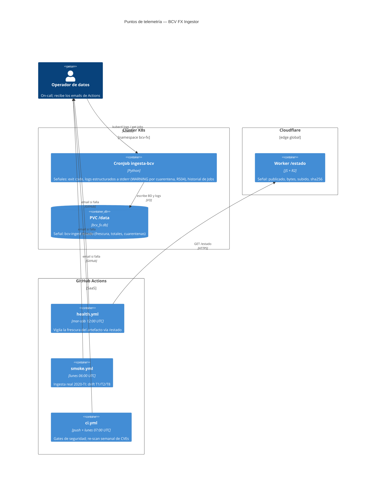
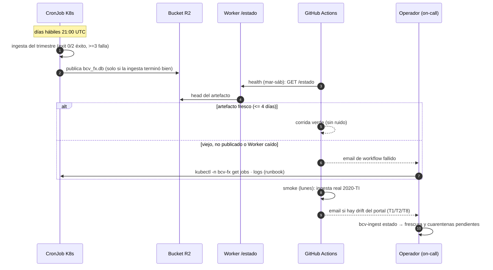
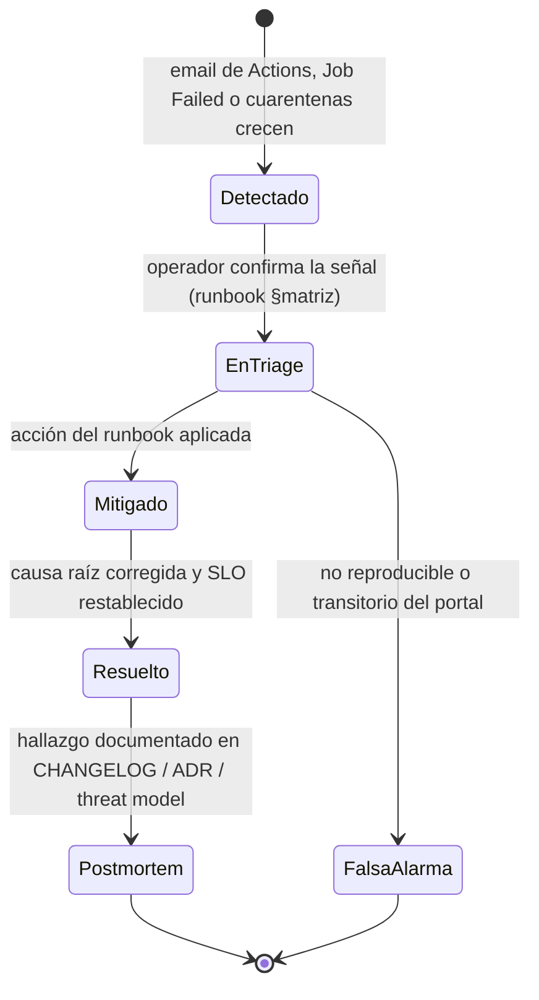
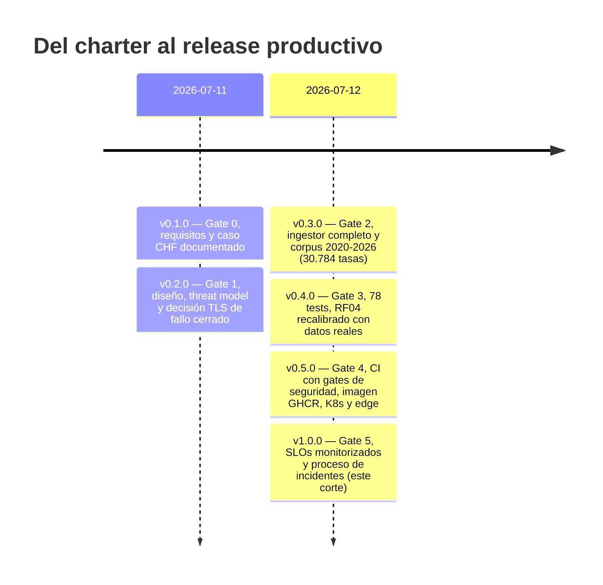

# Observabilidad — BCV FX Ingestor

* **Estado:** review
* **Fecha:** 2026-07-12
* **Decisores:** Jeremi Alcalá
* **Fase AI-DLC:** 06-monitoring
* **Versión:** 1.0.0
* **Gate:** 5
* **SLOs (ref):** tabla §SLIs y SLOs de este documento
* **On-call:** Operador de datos (charter, `<TODO: confirmar>` stakeholder)

Dimensionado al sistema real: un batch diario (CronJob) + distribución de un artefacto, no un
servicio 24/7. No hay stack de telemetría dedicado (Prometheus/Grafana sería desproporcionado
para un Job de 0.04 s/archivo — decisión consciente): las señales nacen de piezas que ya
existen y el canal de alerta es el email de workflow fallido de GitHub Actions.

## SLIs y SLOs

| SLI | SLO | Fuente de la señal | Alerta |
|---|---|---|---|
| Frescura del artefacto publicado (edad de `subido`) | ≤ 4 días naturales | Worker `GET /estado` | `health.yml` (mar–sáb) → email al fallar |
| Drift de la fuente (layout, URLs, TLS del portal) | smoke semanal verde | `smoke.yml` (ingesta real 2020-TI) | email al fallar |
| Éxito de la ingesta programada | ≥ 95 % de corridas/mes | historial de Jobs K8s (`kubectl -n bcv-fx get jobs`) | Job `Failed` → runbook |
| Cuarentenas pendientes | revisadas en ≤ 5 días hábiles | `bcv-ingest estado` (bloques `frescura` y `cuarentenas`) | revisión del operador |
| Pipeline de seguridad | CI verde en main + re-scan semanal (lunes) | Actions / badge | email al fallar |
| Duración de la corrida | < 15 min | `activeDeadlineSeconds: 900` en el CronJob | Job `DeadlineExceeded` |

El SLI de frescura tiene doble medición: en el edge (`/estado` del Worker, lo que ve el
analista) y en origen (`bcv-ingest estado` → `frescura.dias_desde_ultima_jornada`, lo que ve
el operador). Divergencia entre ambos = fallo de publicación, no de ingesta.

## Dónde nace cada señal (eje estructura)

## De la señal a la acción (eje comportamiento)

### Ciclo de vida del incidente

Regla del postmortem: todo incidente real deja traza en el repo — como ya ocurrió dos veces en
este proyecto (cadena TLS incompleta → ADR-0004 §Nota + intermedio vendorizado; falsos
positivos ANG/BOB → RF04 recalibrado con umbral 1.25). El proceso no es aspiracional: está
ejercitado.

## Matriz señal → diagnóstico → acción (runbook de incidentes)

| Señal | Diagnóstico probable | Acción |
|---|---|---|
| `health.yml` rojo: Worker no responde | Worker caído o binding R2 roto | `npx wrangler deploy` / `wrangler rollback`; verificar bucket R2 |
| `health.yml` rojo: artefacto > 4 días | CronJob no corre o publicación falla | `kubectl -n bcv-fx get cronjob,jobs`; logs del initContainer (ingesta) y del contenedor `publicar` (rclone/credenciales) |
| Job fallido con exit ≥ 3 | red o TLS contra el portal (T2/T8) | ver logs: si es `CERTIFICATE_VERIFY_FAILED`, ¿rotó la CA del BCV? → actualizar `deploy/docker/ca-extra/`; si es indisponibilidad → modo local (ADR-0002) |
| `smoke.yml` rojo | drift del portal: layout (T1), patrón de URLs o TLS | comparar anclas del lector contra un archivo recién descargado; actualizar contrato de anclas / patrón y correr la suite |
| `cuarentenas_pendientes` crece | anomalías nuevas de la fuente (T3) | `bcv-ingest estado`; revisar `payload_crudo`; si es patrón legítimo nuevo → recalibrar validador con test de regresión (precedente ANG/BOB) |
| CI rojo en re-scan del lunes | CVE nueva en dependencia o imagen | actualizar la dependencia/base y re-correr; el pin de actions se revisa con el mismo email |
| Job `DeadlineExceeded` | corrida > 15 min (anómalo: lo normal es < 1 s/archivo) | logs del pod; ¿portal lento (T8)? reintentar; si persiste, modo local |

## Monitoreo de seguridad (OWASP A09)

- **Auditoría de decisiones**: cada cuarentena emite `WARNING` estructurado con archivo,
  sha256, hoja y motivo (RS04) — visible en `kubectl logs` y persistido en la tabla
  `cuarentena` con `payload_crudo`.
- **Integridad del artefacto**: sha256 por archivo ingerido (tabla `ingesta`) y `/estado`
  expone el hash del artefacto publicado.
- **Vigilancia continua**: gitleaks en cada push (historia completa), SCA + container scan
  re-corren cada lunes aunque no haya cambios, smoke vigila la superficie externa real.

## Hitos del proyecto (eje trazabilidad)

